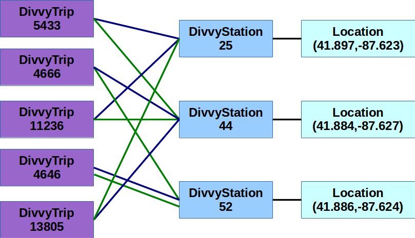

.. _chapter-classes:

Classes and Objects
===================

In the previous chapter, we saw that we can define new data types by creating an
API of functions to operate on that data type (like we did for stacks
and queues). However, this approach has two main limitations.

First of all, when implementing stacks and queues, we decided to use a list to
store information about our stack or queue. For example, the
``stack_create`` function returns an empty list:

.. python-run::
   :formatting: separate

   def stack_create():
       return []

.. python-run::

   s = stack_create()

Once we have that variable ``s``, we can pass it to the other stack
functions (``stack_pop``, ``stack_push``, etc.) and essentially
manipulate it as a stack, even though it actually contains a list.

However, nothing prevents us from manipulating that list in non-stack
ways: we can still use any of Python's list operations directly on it.
In other words, our data type has information that should be *private*
to the data type, and that users of that data type cannot manipulate.
We want those users to access only those operations and data that we
choose to make *public*. Using a function-based API, we can't fully
enforce this separation between the public and private parts of
a data type.

Second, our stack/queue implementations allowed the stack/queue to be
represented with a single variable (a list), which meant we only had
to pass that as a parameter to the other functions. However, not all data
types can be implemented like that. For example, I may want to define
a data type with multiple *attributes*, such as a "student" data type
that includes a first name, a last name, a student ID number, and other
attributes of the student.

One way to address this second issue is to simply encapsulate those multiple
attributes in a list or dictionary. In fact, back in :ref:`chapter-dictionaries`
we saw that this was a common use case of dictionaries. We could store
information about a single student in a dictionary like this:
   
.. python-run::
   :formatting: separate

   student = {
              "first_name": "Johnny",
              "last_name": "Coder",
              "student_id": "313370"
             }
              
In fact, this dictionary could, in turn, include other dictionaries that
represent other data types, like courses or majors:               

.. python-run::
   :formatting: separate

   student = {
              "first_name": "Johnny",
              "last_name": "Coder",
              "student_id": "313370",
              "courses": [{"code": "CMSC 12100",
                           "name": "Computer Science with Applications I"},
                          {"code": "CMSC 12200",
                           "name": "Computer Science with Applications II"}],
              "major": {"name": "Economics",
                        "short_name": "Econ"}
             }

This way, if we defined a function that operates on a student, all we need
to do is pass a single student dictionary to that function (instead of one
parameter for each of the attributes of the student). However, we can still
manipulate that dictionary in ways that may not be allowed (like changing
the student's ID number), and we could potentially use attribute names
that make no sense (e.g., if we made a typo like writing ``firstname`` 
instead of ``first_name``).

The *object-oriented paradigm* (or OO for short) addresses many of these issues by
providing a mechanism to define new data types that encapsulate some
attributes as well as operations that are allowed on the 
data type. OO also allows for a cleaner separation between the
*public* attributes and operations that any programmer can access,
and the *private* ones that only the data type implementor should
be allowed to modify.

Defining a new class
--------------------

In OO, a *class* is the definition of a new type, while *objects* are
specific instances of that data type. One of way to think about this
distinction is that a class is like the blueprint for a car, while
objects are the actual individual cars. There is only one blueprint,
and that blueprint specifies certain characteristics of the car that
may vary from car to car, like its color or engine type. There can be
multiple cars, all built according to the same blueprint, but with
each individual car having different values for a given attribute
(e.g., one car could be red and another blue).

So, let's say we want to define a new data type to represent a
location on Earth. A location will have only two attributes: latitude
and longitude.  So, while we could implement this data type by using a
list of two numbers, and creating a function-based API like we did for
stacks and queues, we will see that defining a location class will have a
number of advantages.

Below is the full specification of a new ``Location`` data type using
an OO approach. For now, don't worry about the individual details
of this code. We will deconstruct it piece by piece soon.

.. python-run::
   :formatting: separate

   import math
   
   class Location(object):   
       def __init__(self, latitude, longitude):
           self.latitude = latitude
           self.longitude = longitude
   
       def to_string(self):
           if (self.latitude < 0.0):
               lat = "S"
           else:
               lat = "N"
   
           if (self.longitude < 0.0):
               lon = "W"
           else:
               lon = "E"
   
           return "({:.3f} {}, {:.3f} {})".format(abs(self.latitude),
                                                  lat,
                                                  abs(self.longitude),
                                                  lon)

       def distance_to(self, other):
           diffLatitude = math.radians(other.latitude - self.latitude)
           diffLongitude = math.radians(other.longitude - self.longitude)
   
           a = math.sin(diffLatitude/2) * math.sin(diffLatitude/2) + \
               math.cos(math.radians(self.latitude)) * \
               math.cos(math.radians(other.latitude)) * \
               math.sin(diffLongitude/2) * math.sin(diffLongitude/2)
           d = 2 * math.asin(math.sqrt(a))
   
           return 6371000.0 * d
           
       def __repr__(self):
           return self.to_string()
           
   

The above code defines a new ``Location`` data type that we can now use in Python
to manipulate geographic locations (specified with a latitude and longitude):

.. python-run::

   chicago_loc = Location( 41.8337329, -87.7321555 )
   newyork_loc = Location( 40.7056308, -73.9780035 )
   chicago_loc.to_string()
   newyork_loc.to_string()
   chicago_loc.distance_to(newyork_loc)
   
Notice how we can create two separate locations, ``chicago_loc`` and ``newyork_loc`` that both
conform to the ``Location`` "blueprint" (they both have their own values for ``latitude`` and ``longitude``).
We can also perform a useful operation on these locations: computing the distance from one
location to another (in this case, the distance from Chicago to New York is 1,155,076 meters, or
1,115.07 kilometers).

Let's now take a closer look at how we have defined the ``Location`` class.

Our definition starts with this line:

.. code:: python

   class Location(object):
   
This line starts the definition of a ``Location`` class: notice how everything else
is indented below the ``class`` statement. 

Inside the class, we have what look like functions: ``__init__``,
``to_string``, ``distance_to``, and ``__repr__``. These definitions are referred to as
*methods*.  The first one is special: it is known as the
*constructor*, and is always called ``__init__``. The constructor
is used to *initialize* a new object.

Remember that a class is like a blueprint, and an object is a specific
*instance* of that class. So, when we do this:

.. code:: python

   chicago_loc = Location( 41.8337329, -87.7321555 )

What we're doing is taking the ``Location`` "blueprint" and constructing a
location with latitude equal to 41.8337329 and longitude equal to -87.7321555. 
Internally, Python builds this instance 
by calling the  ``__init__`` method, which is in charge of *initializing* the coordinates.
However, notice how ``Location``'s constructor actually has three parameters:

.. code:: python

   def __init__(self, latitude, longitude):
   
But, when we create the new ``Location`` object we only provide two
parameters.  When implementing a class, all the methods will have a
``self`` parameter, which represents the object the method is
operating on. In th case of ``__init__``, ``self`` is the new
``Location`` object we are constructing.

The ``__init__`` method is commonly used to initialize the object's *attributes*.
In this case, ``Location`` has two attributes (latitude and longitude),
so we need to set their values. We do so with the ``latitude`` and ``longitude`` parameters
provided to the ``__init__`` method:

.. code:: python

   def __init__(self, latitude, longitude):
       self.latitude = latitude
       self.longitude = longitude

In the above code, ``self.latitude`` can be read as "``latitude`` of ``self``", i.e., the ``latitude``
attribute of the ``self`` object (which is the object we are constructing), while
``latitude`` (by itself, without ``self.``) is just a parameter to the constructor.

So, to recap, when we evaluate this statement:

.. python-run::

   chicago_loc = Location( 41.8337329, -87.7321555 )
   
A new ``Location`` object is created with two attributes, ``latitude`` and ``longitude``, with their
values initialized to ``41.8337329`` and ``-87.7321555``, respectively. The object is then stored in
the ``chicago_loc`` variable. We can actually access the ``latitude`` and ``longitude`` attributes by using
the dot operator:

.. python-run::

   chicago_loc.latitude
   chicago_loc.longitude
   
Once we have created a new object, we can invoke other methods defined in the
``Location`` class. For example, the class includes the following method:

.. code:: python

   def to_string(self):
       if (self.latitude < 0.0):
           lat = "S"
       else:
           lat = "N"

       if (self.longitude < 0.0):
           lon = "W"
       else:
           lon = "E"

       return "({:.3f} {}, {:.3f} {})".format(abs(self.latitude),
                                              lat,
                                              abs(self.longitude),
                                              lon)
       
The purpose of this method is to produce a string representation of the coordinates.
While we could simply print the object's latitude and longitude like this:

.. python-run::

   print(chicago_loc.latitude, chicago_loc.longitude)
   
This method produces a more compact representation that also indicates the hemisphere
of each coordinate:

.. python-run::

   chicago_loc.to_string()
 
This method may look a bit odd because, if we were writing a *function* to do
this, it would look like this:

.. python-run::
   :formatting: separate
   
   def to_string(latitude, longitude):
       if (latitude < 0.0):
           lat = "S"
       else:
           lat = "N"

       if (longitude < 0.0):
           lon = "W"
       else:
           lon = "E"

       return "({:.3f} {}, {:.3f} {})".format(abs(latitude),
                                              lat,
                                              abs(longitude),
                                              lon)

And we would call it like this:

.. python-run::

   to_string(41.8337329, -87.7321555)
   
But, instead, when using objects, we call it like this:

.. python-run::

   chicago_loc.to_string()
   
Remember that the ``self`` parameter contains the object a method is operating on.
Furthermore, this parameter is *implied* whenever we call a method. So, a call
like ``chicago_loc.to_string()`` internally becomes something like this:

.. code:: python

   Location.to_string(chicago_loc)
   
Then, inside the method, an expression like ``self.latitude`` actually evaluates to
"attribute ``latitude`` of object ``chicago_loc``". In fact, notice how calling ``to_string``
on different objects produces different results:

.. python-run::
 
   regenstein_loc = Location( 41.79218,   -87.599934)
   ryerson_loc =    Location( 41.7902836, -87.5991959)
   regenstein_loc.to_string()
   ryerson_loc.to_string()
   
This is because the first call to ``to_string`` is done using the ``regenstein_loc`` object
(which has its ``latitude`` and ``longitude`` attributes set to 41.79218 and -87.599934) and the second
call is done using the ``ryerson_loc`` object (which has its ``latitude`` and ``longitude`` attributes
set to different values: 41.7902836 and -87.5991959).

The ``Location`` class also has a ``__repr__`` method that simply returns the value
return by ``to_string``. The ``__repr__`` method is a special method that is called
any time Python needs a string representation of a given object. So, once we
implement a ``__repr__`` method, we can actually get its string representation
simply by printing the object or by writing an object variable name in the interpreter:

.. python-run::
 
   print(chicago_loc)
   chicago_loc

This mechanism is more convenient than having to remember to call a ``to_string`` method
every time we want a string representation. While we would usually just place
the code from ``to_string`` directly inside ``__repr__``, we separated the
implementation for clarity, and to highlight how we can also call ``to_string``
directly.

Finally, the ``Location`` class has a ``distance_to`` method that takes one parameter besides
``self``. In fact, the purpose of this method is to compute the distance between
two locations, where one location is the ``Location`` object that ``distance`` is called on,
and the second location is passed via a parameter. Like before, one way of thinking
about this is that this call:

.. code:: python

   chicago_loc.distance_to(newyork_loc)
   
Internally becomes something like this:

.. code:: python

   Location.distance_to(chicago_loc, newyork_loc)
   
This ``distance_to`` method computes the distance between two geographic coordinates 
This method computes the distance
between two coordinates (i.e., two longitude/latitude pairs) using the
`haversine formula <http://en.wikipedia.org/wiki/Haversine_formula>`_:
   
.. math::
   2 r \arcsin\left(\sqrt{\sin^2\left(\frac{x_{lat} - y_{lat}}{2}\right) + \cos(y_{lat}) \cos(x_{lat})\sin^2\left(\frac{x_{long} - y_{long}}{2}\right)}\right)
   
where:

   * :math:`x_{lat}, x_{long}` is the latitude and longitude *in radians* of point :math:`x`.
   * :math:`y_{lat}, y_{long}` is the latitude and longitude *in radians* of point :math:`y`.
   * :math:`r` is the radius of the sphere (in this case, Earth's average radius: 6,371km)

Encapsulating the use of this complex formula is yet another example of how functions (or, in this case, methods) can abstract away
complex details about an operation. Instead of having to worry about the complicated formula
above, we are able to manipulate locations with relatively simple operations: 

.. python-run::

   chicago_loc = Location( 41.8337329, -87.7321555 )
   newyork_loc = Location( 40.7056308, -73.9780035 )
   chicago_loc.distance_to(newyork_loc)

.. todo::

   "Everything in Python is an object" section
    

Composition
-----------

So far, we have defined a new data type, ``Location``, that encapsulates
two ``float`` values. However, attributes are not limited to the
built-in types in Python: we can define classes with attributes that
are, themselves, objects. This mechanism is called *composition* and it is very
powerful when defining new data types.

To further illustrate this point, we are going to model information about
Chicago's Divvy bike share system. More specifically, we are going to use
the data from the `2013 Divvy Data
Challenge <https://www.divvybikes.com/datachallenge>`_), which includes
(anonymized) data on all the Divvy bicycle trips taken in
2013, as well as information about each Divvy station where bikes can
be picked up and dropped off. 

Ultimately, we will answer the following question: 
*What is the total duration and total distance of all the Divvy trips taken in 2013?*
As we'll see, going through the effort of modeling the Divvy data using
classes will make it relatively easy to answer not just this question,
but also a number of other questions we did not set out to answer originally.

First of all, we need to model the Divvy stations. The dataset provides
the following information about each station:

* ``id``: A unique integer identifier.
* ``name``: A string with descriptive name (e.g., ``"State St & Harrison St"``) 
* ``latitude``: A float with the latitude of the station.
* ``longitude``: A float with the longitude of the station.
* ``dpcapacity``: The number of total docks at each station as of 2/7/2014
* ``landmark``: An undocumented attribute (the Divvy Challenge never explained what this field meant)
* ``online date``: A string with the date the station went live in the system (e.g., ``"6/28/2013"``)

Given this information, we could define a new ``DivvyStation`` class as follows,
with attributes corresponding to the information above (note: we use ``stationID`` instead
of ``id`` because ``id`` is a reserved keyword in Python):

.. python-run::
   :formatting: separate
   
   class DivvyStation(object):
   
       def __init__(self, stationID, name, latitude, longitude,
                    dpcapacity, landmark, online_date):

           self.stationID = stationID
           self.name = name
           self.latitude = latitude
           self.longitude = longitude
           self.dpcapacity = dpcapacity
           self.landmark = landmark
           self.online_date = online_date

However, we've already defined a ``Location`` class that encapsulates information
about a geographical location *and* which implements some potentially useful
operations on locations, such as the distance between two locations. Since we
want to ultimately compute the total distance of all the Divvy trips, it seems
like we may want to leverage that existing ``Location`` class. 

So, instead of having a ``latitude`` and ``longitude`` attribute, we can
define our class to have a ``location`` attribute that contains a ``Location``
object. 

.. python-run::
   :formatting: separate
      
   class DivvyStation(object):
   
       def __init__(self, stationID, name, latitude, longitude,
                    dpcapacity, landmark, online_date):

           self.stationID = stationID
           self.name = name
           self.location = Location(latitude, longitude)
           self.dpcapacity = dpcapacity
           self.landmark = landmark
           self.online_date = online_date
           
If we follow this approach, adding a method to compute the distance from one
station to another becomes very simple:

.. python-run::
   :formatting: separate
      
   class DivvyStation(object):
   
       def __init__(self, stationID, name, latitude, longitude,
                    dpcapacity, landmark, online_date):

           self.stationID = stationID
           self.name = name
           self.location = Location(latitude, longitude)
           self.dpcapacity = dpcapacity
           self.landmark = landmark
           self.online_date = online_date
           
       def distance_to(self, other_station):
           d = self.location.distance_to(other_station.location)
           return d
        
For example:

.. python-run::

   s25 = DivvyStation(25, "Michigan Ave & Pearson St", 41.89766, -87.62351, 23, 34, "6/28/2013")
   s44 = DivvyStation(44, "State St & Randolph St", 41.8847302, -87.62773357, 27, 2, "6/28/2013")
   s25.distance_to(s44)
   s25.distance_to(s44)
        
Next, we need to model the information about a Divvy trip. The dataset
provides the following information about each trip:

* ``trip_id``: A unique integer identifier for the trip.
* ``starttime``, and ``stoptime``: The start and end time of the trip. 
* ``bikeid``: A unique integer identifier for the bike used in this trip.
* ``tripduration``: The duration (in seconds) of the trip.
* ``from_station_id`` and ``to_station_id``: The integer identifiers of
  the origin and destination stations. 
* ``from_station_name`` and ``to_station_name``: The names of the origin
  and destination stations. 
* ``usertype``:  This field will be either ``Customer`` or ``Subscriber``.
  A "customer" is a rider who purchased a 24-Hour Pass, and a "subscriber" is a 
  rider who purchased an Annual Membership. 
* ``gender``: The gender of the rider. This field only has a value when the rider is a subscriber.
* ``birthday``: The date of birth of the rider. This field only has a value when the rider is a subscriber.

Since we already defined a ``DivvyStation`` class, we will use it to
represent the information about the origin and destination stations.
So, when defining a ``DivvyTrip`` class, instead of having ``from_station_id``
and ``to_station_id`` attributes, we will instead have a ``from_station``
attribute that will contain a ``DivvyStation`` object (we will also
have a similar ``to_station`` attribute). So, the class will look like this:

.. python-run::
   :formatting: separate

   class DivvyTrip(object): 
       def __init__(self, trip_id, starttime, stoptime, bikeid,
                    tripduration, from_station, to_station, 
                    usertype, gender, birthyear):
           self.trip_id = trip_id
           self.starttime = starttime
           self.stoptime = stoptime
           self.bikeid = bikeid
           self.tripduration = tripduration
           self.from_station = from_station
           self.to_station = to_station
           self.usertype = usertype
           self.gender = gender
           self.birthyear = birthyear    
       
Now, let's say we created three stations:

.. python-run::

   s25 = DivvyStation(25, "Michigan Ave & Pearson St", 41.89766, -87.62351, 23, 34, "6/28/2013")
   s44 = DivvyStation(44, "State St & Randolph St", 41.8847302, -87.62773357, 27, 2, "6/28/2013")
   s52 = DivvyStation(52, "Michigan Ave & Lake St", 41.88605812, -87.62428934, 23, 43, "6/28/2013")
   
   
When creating the ``DivvyTrip`` objects, we would use the above ``DivvyStation`` objects
as values for the ``from_station`` and ``to_station`` parameters to the constructor:

.. python-run::
   
   trip5433 = DivvyTrip(5433,   "2013-06-28 10:43", "2013-06-28 11:03", 218, 1214, 
                        s25, s44, "Customer", None, None)
   trip4666 = DivvyTrip(4666,   "2013-06-27 20:33", "2013-06-27 21:22", 242, 2936, 
                        s44, s52, "Customer", None, None)   
   trip11236 = DivvyTrip(11236, "2013-06-30 15:41", "2013-06-30 15:58", 906, 1023, 
                         s25, s44, "Customer", None, None)   
   trip4646 = DivvyTrip(4646,   "2013-06-27 20:22", "2013-06-27 20:39", 477, 996, 
                        s52, s52, "Customer", None, None)   
   trip13805 = DivvyTrip(13805, "2013-07-01 13:21", "2013-07-01 13:35", 469, 858, 
                         s44, s25, "Customer", None, None)   
                         
Notice how we can reuse the ``DivvyStation`` objects across ``DivvyTrip`` objects.
For example, ``s25`` is the origin station in ``trip5433`` and ``trip11236``, as
well as the destination station in ``trip13805``. This is yet another example
of how we can *compose* multiple classes together to form complex data structures.
The following figure shows these composition relationships between the objects
we have created so far (blue lines represent an "origin station" relation and green lines represent a
"destination station" relation): 
   

   
Notice how the ``DivvyStation`` objects are "shared" between the various ``DivvyTrip``
objects, and how it is even possible for a trip to have the same ``DivvyStation`` object
as its origin *and* its destination.

Another advantage of this composition is that we can conveniently access information 
about the origin and destination stations
through the ``from_station`` and ``to_station`` attributes:

.. python-run::

   trip5433.from_station.name
   trip4646.to_station.location      
   trip13805.to_station.stationID                
                         
This also means that adding a ``get_distance`` method to the ``DivvyTrip``
class, to compute the distance from the origin station to the destination
station, becomes very simple:

.. python-run::
   :formatting: separate

   class DivvyTrip(object): 
       def __init__(self, trip_id, starttime, stoptime, bikeid,
                    tripduration, from_station, to_station, 
                    usertype, gender, birthyear):
           self.trip_id = trip_id
           self.starttime = starttime
           self.stoptime = stoptime
           self.bikeid = bikeid
           self.tripduration = tripduration
           self.from_station = from_station
           self.to_station = to_station
           self.usertype = usertype
           self.gender = gender
           self.birthyear = birthyear    
       
       def get_distance(self):
           return self.from_station.distance_to(self.to_station)
           
It seems like we're getting closer to the point where we can answer the question
we originally posed: *What is the total duration and total distance of all the Divvy trips taken in 2013?*
However, so far, we've been creating ``DivvyStation`` and ``DivvyTrip`` objects
manually. To answer this question, we will need to load the entire Divvy dataset.
To do this, we have written a ``DivvyData`` class that encapsulates all
interactions with the full dataset. We will not discuss the internal details
of ``DivvyData`` here, but we encourage you to look at its source code.

We can create a ``DivvyData`` object as follows:

.. code:: python

   data = DivvyData(stations_filename="data/divvy_2013_stations.csv", 
                    trips_filename="data/divvy_2013_trips.csv") 

This object has two attributes: ``stations``, with a list of ``DivvyStation`` objects
corresponding to the stations in the dataset, and ``trips`` with a list of ``DivvyTrips``
objects.

.. code:: python

   >>> len(data.stations)
   300
   >>> len(data.trips)
   759788

Computing the total distance of all the trips now involves just a simple ``for`` loop:

.. code:: python

   >>> total_distance = 0.0
   >>> for trip in data.trips:
   ...     total_distance += trip.get_distance()
   ...
   >>> total_distance
   1557441209.2794986
   
Notice how that single call to ``get_distance`` abstracts away a lot of the details
we've described above. ``get_distance`` takes the origin and destination stations,
calls the ``distance_to`` method in ``DivvyStation`` which, in turn, accesses
the ``location`` attributes of the stations, and calls the ``distance_to`` method
in ``Location`` which implements a fairly elaborate formula that we are blissfully
unaware of in the above piece of code.
   
Similarly, the total duration of all the trips involves an equally simple for loop:

.. code:: python

   >>> total_duration = 0.0
   >>> for trip in data.trips:
   ...     total_duration += trip.tripduration
   ...
   >>> total_duration
   941734778.0
   
Now that we've organized our data in this way, and created convenient abstractions
around stations and trips, it becomes easy to perform other computations. For example,
by using Python's ``collections.Counter`` class (which itself provides a convenient
abstraction around "counting things"), we can easily find out what are the top 10 origin
stations in the Divvy system:

.. code:: python

   >>> from collections import Counter
   >>> origin_stations = []
   >>> for t in data.trips:
   ...     origin_stations.append(t.from_station)
   >>> c = Counter(origin_stations)
   >>> for station, count in c.most_common(10):
   ...     print("{:30} {}".format(station.name, count)) 
   ...     
   Millennium Park                17272
   Streeter Dr & Illinois St      16710
   Lake Shore Dr & Monroe St      15673
   Clinton St & Washington Blvd   14967
   Michigan Ave & Oak St          13274
   Museum Campus                  12676
   McClurg Ct & Illinois St       10847
   Michigan Ave & Lake St         10760
   Canal St & Jackson Blvd        10141
   Franklin St & Jackson Blvd     9784

.. todo::

   Maybe write a box providing a counterpoint that shows how much more complicated
   this would've been without objects? (e.g., if we were using dictionaries to
   represent stations and trips)

Public vs private attributes
----------------------------

As you may have noticed, once we create a ``Location`` object, we can 
access its attributes freely:

.. python-run::

   chicago_loc = Location( 41.8337329, -87.7321555 )
   chicago_loc.latitude
   chicago_loc.longitude
   
We can also *modify* these attributes:

.. python-run::

   chicago_loc
   chicago_loc.latitude = -70.67
   chicago_loc

However, allowing unfettered access to the attributes like this
could make our ``Location`` class fail in some cases. For example,
let's say we create the following locations: 

.. python-run::

   chicago_loc = Location( 41.8337329, -87.7321555 )
   newyork_loc = Location( 40.7056308, -73.9780035 )

We can now obtain the distance between the two locations like this:

.. python-run::

   chicago_loc.distance_to(newyork_loc)

But, if we now change the ``latitude`` coordinate of point ``newyork_loc`` to 
an invalid value, like a string, it will make the ``distance_to``
method fail, because it performs operations on ``latitude`` that
assume that the attribute will contain a number:

.. python-run::

   newyork_loc.latitude = "foobar"
   chicago_loc.distance_to(newyork_loc)

The problem here is that ``latitude`` and ``longitude`` are *public* attributes,
meaning that the user of the ``Location`` class can read and modify
their values. Ideally, we would like to make these attributes
*private*, and provide a controlled mechanism for access the
values of ``latitude`` and ``longitude``.

To explain how to make attributes private, we will use two new classes,
``Point`` and ``Line``, each of which are originally implemented with
public attributes. ``Point`` represent a point in two-dimensional
space:

.. python-run::
   :formatting: separate
   
   class Point(object):
       def __init__(self, x, y):
           self.x = x
           self.y = y
       
       def __repr__(self):
           return "({}, {})".format(self.x, self.y)
           
       def to_polar(self):
           r = math.sqrt( self.x**2 + self.y**2 )
           theta = math.degrees( math.atan( self.y / self.x ) )
           return r, theta
       
       def distance(self, other):
           return math.sqrt((self.x - other.x)**2 + (self.y - other.y)**2)

``Line`` represents a line in two-dimensional spaces, as specified by 
two points: 

.. python-run::
   :formatting: separate

   class Line(object):
       def __init__(self, p0, p1):
           self.p0 = p0
           self.p1 = p1
           
       def is_vertical(self):
           return self.p0.x == self.p1.x
   
       def get_slope(self):
           if self.is_vertical():
               return float('inf')
           else:
               return (self.p1.y - self.p0.y) / (self.p1.x - self.p0.x)
           
       def get_y_intercept(self):
           if self.is_vertical():
               if self.p0.x == 0:
                   return 0.0
               else:
                   return float('NaN')
           else:
               return self.p0.y - self.get_slope()*self.p0.x
   
       def __repr__(self):
           if self.is_vertical():
               return "x = {}".format(self.p0.x)
           else:
               return "y = {}*x + {}".format(self.get_slope(), self.get_y_intercept())

Notice how this is yet another example of composition:
a ``Line`` object will be composed of two ``Point`` objects:

.. python-run::
   
   p = Point(0, 7)
   q = Point(1, 12)
   l = Line(p, q)
   l.get_slope()
   l.get_y_intercept()
   l

We will focus first on the ``Point`` class. Its two attributes
are currently public, which means we can modify them freely and,
as with the ``Location`` class, this design can cause errors if we
set the value of ``x`` or ``y`` to an invalid value:

.. python-run::

   l.get_slope()
   p.x = "foobar"
   l.get_slope()

To make ``x`` and ``y`` private, we will rename them to ``_x`` and ``_y``:

.. python-run::
   :formatting: separate

   class Point(object):
       def __init__(self, x, y):
           self._x = x
           self._y = y

Adding a single underscore before an attribute name is a common
Python convention to indicate that an attribute shouldn't
be directly accessed by the users of the class. i.e., they
are intended to be *private* attributes that only the developers
of the class should be able to manipulate.

Of course, we may want to give users of the ``Point`` class
the ability to read and modify these attributes, but we want
to do so in a controlled manner: we want to make sure they
value of these attributes is always a number.

One way of doing this is by adding *getter* and *setter*
method. These are methods whose purpose is to *get* or *set*
the value of an attribute. For example, the getter and
setter for ``_x`` would look like this:

.. code:: python

   def get_x(self):
       return self._x

   def set_x(self, x):
       if not isinstance(x, (int, float)): 
           raise ValueError("Not a number")
       self._x = x
     
       
Notice how ``set_x`` first checks whether the provided parameter ``x`` is an
``int`` or a ``float`` and, if not, raises a ``ValueError`` exception. We have
not seen exceptions in detail yet, but this will basically make the program fail
if we try to set ``x`` to be anything but a number.

The complete implementation of the ``Point`` class with getters and setters would
look like this. Notice how the ``__init__`` method also calls the setters, to ensure
that the values of the attributes provided to the constructor are also correct:       

.. python-run::
   :formatting: separate

   class Point(object):
       def __init__(self, x, y):
           self.set_x(x)
           self.set_y(y)
       
       def get_x(self):
           return self._x
       
       def set_x(self, x):
           if not isinstance(x, (int, float)): 
               raise ValueError("Not a number")
           self._x = x
           
       def get_y(self):
           return self._y
       
       def set_y(self, y):
           if not isinstance(y, (int, float)): 
               raise ValueError("Nor a number")
           self._y = y        
       
       def __repr__(self):
           return "({}, {})".format(self._x, self._y)

       def to_polar(self):
           r = math.sqrt( self._x**2 + self._y**2 )
           theta = math.degrees( math.atan( self._y / self._x ) )
           return r, theta
       
       def distance(self, other):
           return math.sqrt((self._x - other._x)**2 + (self._y - other._y)**2)

Now, we can use the ``Point`` class as before, except we use the getters
and setters to access the ``_x`` and ``_y`` attributes. If we try to
set either of them to an invalid value, we will get an error:

.. python-run::

   p = Point(2,3)
   p.get_x()
   p.set_x(3.14)
   p
   p.set_x("foobar")

Notice how ``to_polar`` and ``distance`` *don't* use the getters and setters.
The getters and setters are part of the class's *public* interface, so
the users of our data type must use them to access the x and y coordinates.
However, in the internal implementation of the class, we are still free
to use the ``_x`` and ``_y`` attributes directly.

However, it is worth reiterating that adding a single underscore before
an attribute name only makes the attribute private *by convention*, meaning that
other programmers should know not to use any attribute that starts with
an underscore, but Python doesn't actually protect these attributes:

.. python-run::

   p._x
   p._x = 5
   p

If we want to make an attribute private, we can use two underscores
before the attribute name (although, technically, this action doesn't make the 
attribute truly private; there are still ways of accessing that attribute,
but they are slightly obfuscated, and not as simple as just using
the name of the attribute with two underscores). However, we should
be careful when doing this: if we are implementing *multiple* classes,
we may want one class to access the attributes of another class. Using
a single underscore will allow us to do that, while signalling to
programmers that use the classes that they should not use those
attributes directly. On the other hand, using two underscores will prevent 
other classes from accessing those attributes.

Properties
----------

Switching to private attributes, and adding getters/setters, gives us
greater control on how users of the ``Point`` class interact with its
attributes. However, it also means that accessing or modifying an attribute now requires
writing code like this:

.. code:: python

   p.get_x()
   p.set_x(42)
   
Instead of this, which is arguably more readable:

.. code:: python

   p.x
   p.x = 42
   
On top of that, if we originally wrote a class with public attributes, 
and then decide we need private attributes and getters/setters, we need 
to rewrite all the code that depended on those attributes. In fact,
that's what we would need to do with the ``Line`` class, which will
now be broken because our ``Point`` class now has an ``_x`` attribute
instead of an ``x`` attribute:

.. python-run::

   p = Point(0, 7)
   q = Point(1, 12)
   l = Line(p, q)
   l.get_slope()

Fortunately, instead of having to re-write the ``Line`` class to use
the getters and setters, we can modify the ``Point`` class to
provide *managed attributes*. A managed attribute is a publicly
accessible attribute, but where access to the attribute is
*managed* by a getter and/or setter (without requiring the user
of the class to explicitly call the getter or setter). 

For example, in the ``Point`` class, we can define private
``_x`` and ``_y`` attributes, and then define public *managed*
attributes called ``x`` and ``y`` which, when accessed,
actually translate internally to a call to the getter/setter
for ``_x`` and ``_y``. In other words, when we do something like
this:

.. code:: python

   p.x
   p.x = 42
   
Python will translate the above to calls to the following:

.. code:: python

   p.get_x()
   p.set_x(42)
   
In Python, this is accomplished by using *properties*. A property
is defined inside the class like this:

.. parsed-literal::

   *<property_name>* = property(*<getter>*, *<setter>*)
   
For example, in the ``Point`` class, we would just add the following
to our class definition below the definitions of the get and set
methods:

.. code:: python

   x = property(get_x, set_x)
   y = property(get_y, set_y)
   
The complete code for the class would now look like this:

.. python-run::
   :formatting: separate

   class Point(object):
       def __init__(self, x, y):
           self.x = x
           self.y = y
           
       def get_x(self):
           return self._x
       
       def set_x(self, x):
           if not isinstance(x, (int, float)): 
               raise ValueError("Not a number")
           self._x = x
           
       def get_y(self):
           return self._y
       
       def set_y(self, y):
           if not isinstance(y, (int, float)): 
               raise ValueError("Nor a number")
           self._y = y        
   
       # Property definitions. Must be done *after* we've defined the getters/setters.
       x = property(get_x, set_x)
       y = property(get_y, set_y)
   
       def __repr__(self):
           return "({}, {})".format(self.x, self.y)
       
       def to_polar(self):
           r = math.sqrt( self._x**2 + self._y**2 )
           theta = math.degrees( math.atan( self._y / self._x ) )       
       
       def distance(self, other):
           return math.sqrt((self.x - other.x)**2 + (self.y - other.y)**2)

Now, whenever we access ``x`` and ``y`` (which are not actual attributes,
they just behave like attributes), Python will translate the use into a call to the
corresponding getter or setter. This behavior is specially evident if we try
to set the value of ``x`` to an invalid value:

.. python-run::

   p = Point(2,3)
   p.x
   p.x = 6
   p
   p.x = "foo"

Notice how we also access the attributes in this manner from inside the constructor,
instead of manipulating the private ``_x`` and ``_y`` attributes:

.. code:: python

   def __init__(self, x, y):
       self.x = x
       self.y = y

This ensures that we are not able to create a ``Point`` object with invalid
values for ``x`` or ``y``:

.. python-run::

   p = Point(100, "foobar")
   
Take into account that properties also allow us to define immutable attributes.
All we have to do is *not* provide a setter when creating the property. For example:  

.. code:: python

   x = property(get_x)
   y = property(get_y)
   
Notice how, after making these changes, our implementation of Line works again:

.. python-run::

   p = Point(0, 7)
   q = Point(1, 12)
   l = Line(p, q)
   l.get_slope()

Finally, we can also define properties using *function decorators*,
which allow us to annotate the getters/setters directly. For example,
this is how our ``Point`` class would look if we used function decorators
to annotate the getters and setters:

.. python-run::
   :formatting: separate

   class Point(object):
       def __init__(self, x, y):
           self.x = x
           self.y = y
           
       # Notice how the name of the method is not "get_x" but simply "x" 
       # the name of the attribute.
       @property
       def x(self):
           return self._x
       
       # Now we define the setter, which has the same name, but an
       # additional parameter (the value being set). Notice how the
       # decorator isn't "@property", it's the name the attribute and .setter
       @x.setter
       def x(self, x):
          if not isinstance(x, (int, float)): 
              raise ValueError("Not a number")
          self._x = x
           
       @property
       def y(self):
           return self._y
       
       @y.setter
       def y(self, y):
           if not isinstance(y, (int, float)): 
               raise ValueError("Nor a number")
           self._y = y        
   
       def __repr__(self):
           return "({}, {})".format(self.x, self.y)
       
       def distance(self, other):
           return math.sqrt((self.x - other.x)**2 + (self.y - other.y)**2)

.. admonition:: When to use public attributes, private attributes, and properties

   Using private attributes with getter and setters (with or without properties)
   does come at a cost: instead of accessing attributes directly (which is a very
   efficient operation), we now have to incur in the cost of a function call
   every time we interact with an attribute. Even if the performance hit is
   small, it still means we have to define a getter and possibly a setter
   for every attribute. This can resulted in a very bloated implementation if,
   say, we have a class with 50 attributes.
   
   A good strategy is to start by implementing your code using public attributes.
   If the classes you are writing are going to be used only by you, or if you
   are just prototyping some code, there is probably not immediate advantage
   to using private attributes and getters/setters. However, if there comes a
   point when you need to manage access to the attributes, you can switch
   to using properties, which will not break any existing code that relied
   on those attributes.
   
   In any case, if you are writing classes that will be used by other
   programmers, it is generally a good idea to very clearly separate
   the private and public data of your class, and making sure that
   access to private attributes is either managed through the use of
   getters/setters or properties or hidden from the client all
   together.
    

Class/static attributes vs instance attributes
----------------------------------------------

In the ``Point`` class, ``x`` and ``y`` are *instance* attributes. This
means that each ``Point`` object (or *instance* of the ``Point`` class)
will have their own values for ``x`` and ``y``:

.. python-run::

   p1 = Point(2,3)
   p2 = Point(5,6)
   p1.x
   p2.x

We can also define *class attributes* which belong to the class as a
whole, not to individual instances. These are also referred to as
*static attributes*.

A common use case for this mechanism is to define *constants* that are relevant to
that class. This would make sense in our ``Location`` class, where the ``distance_to``
method hardcoded the average radius of Earth (``6371000.0`` below):

.. code:: python

   def distance_to(self, other):
       diffLatitude = math.radians(other.latitude - self.latitude)
       diffLongitude = math.radians(other.longitude - self.longitude)

       a = math.sin(diffLatitude/2) * math.sin(diffLatitude/2) + \
           math.cos(math.radians(self.latitude)) * \
           math.cos(math.radians(other.latitude)) * \
           math.sin(diffLongitude/2) * math.sin(diffLongitude/2)
       d = 2 * math.asin(math.sqrt(a))

       return 6371000.0 * d
          
While we could define this as a global constant outside the ``Location``
class:
          
.. code:: python

   EARTH_RADIUS = 6371000.0
    
   class Location(object):
       ...

We can instead define that value *inside* the ``Location`` class:

.. code:: python

   class Location(object):
       EARTH_RADIUS = 6371000.0
        
       ...
       
So the return statement in ``distance_to`` would now be this:

.. code:: python

   return Location.EARTH_RADIUS * d
       
Notice how, to access the value of a class attribute, we need to qualify it
with the name of the class.

Another common use case for class attributes is when we have some data
that needs to be shared by all instances of a class. In essence, this
attribute is like a global variable, but one where we restrict the
scope of the variable to a specific class. For example, if we have a
``Client`` class and want to assign each new object an incrementing
identifier, we could define our class like this:

.. python-run::
   :formatting: separate

   class Client(object):
       next_identifier = 1
        
       def __init__(self, name):
           self.name = name
           self.identifier = Client.next_identifier
           Client.next_identifier += 1
           
This class defines a class attribute ``next_identifier`` that is
initialized to ``1`` at the start of our program, and which
is incremented every time we construct a new ``Client`` object:

.. python-run::

   a = Client("Alice")
   b = Client("Bob")
   c = Client("Carol")
   a.identifier
   b.identifier
   c.identifier
   Client.next_identifier

..
    Class/static methods vs instance methods
    ----------------------------------------

    Similarly, we can define *class* methods that operate on the class as a
    whole, not on an individual instance of the class. Python actually
    distinguishes between class methods and static methods, which are subtly
    different. We will start with class methods, which tend to be more
    useful that static methods.

    A class method is similar to an instance method, except instead of
    getting a ``self`` parameter, it gets a ``cls`` parameter containing the
    *class*. In particular, we can use ``cls(...)`` to create instances of
    the class. This is useful when we want to create instances of the class
    in ways beyond what is allowed by the ``__init__`` method.

    For example, our ``Line`` class has a constructor that takes two points
    as arguments. However, we can imagine constructing a ``Line`` starting
    from the slope and y-intercept. Other languages allow us to define
    multiple constructors, but Python does not. So, the way this is done in
    Python is by defining class methods that define additional ways of
    constructing objects. For example:

    .. code:: python

        class Line(object):
            def __init__(self, p0, p1):
                self.p0 = p0
                self.p1 = p1
        
            # Additional constructor
            @classmethod
            def from_slope_intercept(cls, slope, y_intercept):
                # Create the points starting from slope and y_intercept
                p0 = Point(0, y_intercept)
                p1 = Point(1, slope + y_intercept)
                
                # Create a Line instance with those points, and return
                instance = cls(p0, p1)
                
                return instance
                
            def is_vertical(self):
                return self.p0.x == self.p1.x
        
            def get_slope(self):
                if self.is_vertical():
                    return float('inf')
                else:
                    return (self.p1.y - self.p0.y) / (self.p1.x - self.p0.x)
                
            def get_y_intercept(self):
                if self.is_vertical():
                    if self.p0.x == 0:
                        return 0.0
                    else:
                        return float('NaN')
                else:
                    return self.p0.y - self.get_slope()*self.p0.x
        
            def __repr__(self):
                if self.is_vertical():
                    return "x = {}".format(self.p0.x)
                else:
                    return "y = {}*x + {}".format(self.get_slope(), self.get_y_intercept())

    .. code:: python

        l = Line.from_slope_intercept(slope = 5, y_intercept = 7)

    .. code:: python

        l

    .. parsed-literal::

        y = 5.0*x + 7.0

    .. code:: python

        l.p0

    .. parsed-literal::

        (0, 7)

    .. code:: python

        l.p1

    .. parsed-literal::

        (1, 12)

    .. code:: python

        l2 = Line(Point(0,7), Point(1,12))

    .. code:: python

        l2

    .. parsed-literal::

        y = 5.0*x + 7.0

    A static method is like a class method except it does not have a ``cls``
    parameter. It is essentially a function that is namespaced under a given
    class. A common use case is to define a function that, conceptually, is
    tied to a class, but that doesn't actually operate on specific instances
    of a class. Static methods are less common because, in most cases, a
    top-level function (i.e., not defined inside a class) would be just as
    good.

    For example, if we define a ``Grade`` class:

    .. code:: python

        class Grade(object):
            
            LETTERS = {"A": 4.0,
                       "B": 3.0,
                       "C": 2.0,
                       "D": 1.0,
                       "F": 0.0}
            
            MODIFIERS = { "":  0.0,
                         "-": -0.33,
                         "+": +0.33}
            
            MODIFIERS_APPLY_TO = { "": ["A", "B", "C", "D"],
                                  "-": ["A", "B", "C"],
                                  "+": ["B", "C", "D"]}
            
            def __init__(self, grade_str):
                if len(grade_str) == 1:
                    letter = grade_str
                    modifier = ""
                elif len(grade_str) == 2:
                    letter = grade_str[0]
                    modifier = grade_str[1]
                else:
                    raise ValueError("{} is not a valid grade")
                    
                if letter not in Grade.LETTERS:
                    raise ValueError("{} is not a valid letter for a grade".format(letter))
                    
                if modifier not in Grade.MODIFIERS:
                    raise ValueError("{} is not a valid modifier".format(modifier))
                elif letter not in Grade.MODIFIERS_APPLY_TO[modifier]:            
                    raise ValueError("{} is not a valid modifier for {}".format(modifier, letter))
                    
                self.letter = letter
                self.modifier = modifier
                
            def value(self):
                return Grade.LETTERS[self.letter] + Grade.MODIFIERS[self.modifier]       
            
            def __repr__(self):
                return "{}{} ({})".format(self.letter, self.modifier, self.value())
                

    .. code:: python

        g = Grade("A-")

    .. code:: python

        g.value()

    .. parsed-literal::

        3.67

    .. code:: python

        g2 = Grade("Z")

    ::

        ---------------------------------------------------------------------------

        ValueError                                Traceback (most recent call last)

        <ipython-input-77-c47c80cde4c7> in <module>()
        ----> 1 g2 = Grade("Z")
        

        <ipython-input-74-bf65e726ebff> in __init__(self, grade_str)
             26 
             27         if letter not in Grade.LETTERS:
        ---> 28             raise ValueError("{} is not a valid letter for a grade".format(letter))
             29 
             30         if modifier not in Grade.MODIFIERS:

        ValueError: Z is not a valid letter for a grade

    .. code:: python

        g2 = Grade("A!")

    ::

        ---------------------------------------------------------------------------

        ValueError                                Traceback (most recent call last)

        <ipython-input-78-ccf875a38e20> in <module>()
        ----> 1 g2 = Grade("A!")
        

        <ipython-input-74-bf65e726ebff> in __init__(self, grade_str)
             29 
             30         if modifier not in Grade.MODIFIERS:
        ---> 31             raise ValueError("{} is not a valid modifier".format(modifier))
             32         elif letter not in Grade.MODIFIERS_APPLY_TO[modifier]:
             33             raise ValueError("{} is not a valid modifier for {}".format(modifier, letter))

        ValueError: ! is not a valid modifier

    .. code:: python

        g2 = Grade("A+")

    ::

        ---------------------------------------------------------------------------

        ValueError                                Traceback (most recent call last)

        <ipython-input-79-3a3eb95fd15e> in <module>()
        ----> 1 g2 = Grade("A+")
        

        <ipython-input-74-bf65e726ebff> in __init__(self, grade_str)
             31             raise ValueError("{} is not a valid modifier".format(modifier))
             32         elif letter not in Grade.MODIFIERS_APPLY_TO[modifier]:
        ---> 33             raise ValueError("{} is not a valid modifier for {}".format(modifier, letter))
             34 
             35         self.letter = letter

        ValueError: + is not a valid modifier for A

    .. code:: python

        g2 = Grade("B+")

    .. code:: python

        g2

    .. parsed-literal::

        B+ (3.33)

    .. code:: python

        g2.value()

    .. parsed-literal::

        3.33

    We've incorporated some validation logic into the constructor, but it
    seems like this could be useful in its own right. For example, if we're
    parsing grade data, we don't necessarily want to create a Grade object
    every time we encounter a grade string; we just want to validate that
    it's correct. So, we can create a static method for this:

    .. code:: python

        class Grade(object):
            
            LETTERS = {"A": 4.0,
                       "B": 3.0,
                       "C": 2.0,
                       "D": 1.0,
                       "F": 0.0}
            
            MODIFIERS = { "":  0.0,
                         "-": -0.33,
                         "+": +0.33}
            
            MODIFIERS_APPLY_TO = { "": ["A", "B", "C", "D"],
                                  "-": ["A", "B", "C"],
                                  "+": ["B", "C", "D"]}
            
            # Returns the letter and modifier if the grade is valid.
            # Otherwise, raises a ValueError.
            @staticmethod
            def validate(grade_str):
                if len(grade_str) == 1:
                    letter = grade_str
                    modifier = ""
                elif len(grade_str) == 2:
                    letter = grade_str[0]
                    modifier = grade_str[1]
                else:
                    raise ValueError("{} is not a valid grade")
                    
                if letter not in Grade.LETTERS:
                    raise ValueError("{} is not a valid letter for a grade".format(letter))
                    
                if modifier not in Grade.MODIFIERS:
                    raise ValueError("{} is not a valid modifier".format(modifier))
                elif letter not in Grade.MODIFIERS_APPLY_TO[modifier]:            
                    raise ValueError("{} is not a valid modifier for {}".format(modifier, letter))
                    
                return letter, modifier
            
            def __init__(self, grade_str):
                self.letter, self.modifier = Grade.validate(grade_str)
                
            def value(self):
                return Grade.LETTERS[self.letter] + Grade.MODIFIERS[self.modifier]       
            
            def __repr__(self):
                return "{}{} ({})".format(self.letter, self.modifier, self.value())

    .. code:: python

        Grade.validate("A-")

    .. parsed-literal::

        ('A', '-')

    .. code:: python

        Grade.validate("C+")

    .. parsed-literal::

        ('C', '+')

    .. code:: python

        Grade.validate("A+")

    ::

        ---------------------------------------------------------------------------

        ValueError                                Traceback (most recent call last)

        <ipython-input-86-2512c84e70af> in <module>()
        ----> 1 Grade.validate("A+")
        

        <ipython-input-83-626b352c516c> in validate(grade_str)
             34             raise ValueError("{} is not a valid modifier".format(modifier))
             35         elif letter not in Grade.MODIFIERS_APPLY_TO[modifier]:
        ---> 36             raise ValueError("{} is not a valid modifier for {}".format(modifier, letter))
             37 
             38         return letter, modifier

        ValueError: + is not a valid modifier for A

    .. code:: python

        g = Grade("A-")

    .. code:: python

        g

    .. parsed-literal::

        A- (3.67)

    Notice how we could've easily written that as en external function

    A note on constructing objects
    ------------------------------

    (only if we have time)

    In Python, it is usually preferable for the ``__init__`` method's
    parameters to match (as closely as possible) the attributes of the
    object. Notice how, in the Grade class, we can only construct objects
    starting from a string. This is reasonable, but it's less flexible than
    having a constructor that takes a ``letter`` and ``modifier`` parameter.
    So, a better implementation of grade could be:

    .. code:: python

        class Grade(object):
            
            LETTERS = {"A": 4.0,
                       "B": 3.0,
                       "C": 2.0,
                       "D": 1.0,
                       "F": 0.0}
            
            MODIFIERS = { "":  0.0,
                         "-": -0.33,
                         "+": +0.33}
            
            MODIFIERS_APPLY_TO = { "": ["A", "B", "C", "D"],
                                  "-": ["A", "B", "C"],
                                  "+": ["B", "C", "D"]}
            
            # Raises a ValueError if the letter or modifier are not valid.
            # Otherwise, doesn't return anything.
            @staticmethod
            def validate(letter, modifier = ""):
                if letter not in Grade.LETTERS:
                    raise ValueError("{} is not a valid letter for a grade".format(letter))
                    
                if modifier not in Grade.MODIFIERS:
                    raise ValueError("{} is not a valid modifier".format(modifier))
                elif letter not in Grade.MODIFIERS_APPLY_TO[modifier]:            
                    raise ValueError("{} is not a valid modifier for {}".format(modifier, letter))
                        
            # Parse a grade string into a letter and modifier
            # Raises a ValueError if the letter or modifier are not valid.
            @staticmethod
            def parse(grade_str):
                if len(grade_str) == 1:
                    letter = grade_str
                    modifier = ""
                elif len(grade_str) == 2:
                    letter = grade_str[0]
                    modifier = grade_str[1]
                else:
                    raise ValueError("{} is not a valid grade")
                    
                Grade.validate(letter, modifier)
                
                return letter, modifier
            
            def __init__(self, letter, modifier):
                Grade.validate(letter, modifier)
                self.letter = letter
                self.modifier = modifier
                
            # Additional constructor
            @classmethod
            def from_str(cls, grade_str):
                letter, modifier = Grade.parse(grade_str)
                return cls(letter, modifier)
                
            def value(self):
                return Grade.LETTERS[self.letter] + Grade.MODIFIERS[self.modifier]       
            
            def __repr__(self):
                return "{}{} ({})".format(self.letter, self.modifier, self.value())

    .. code:: python

        g = Grade("A", "-")

    .. code:: python

        g2 = Grade.from_str("B")

    .. code:: python

        g

    .. parsed-literal::

        A- (3.67)

    .. code:: python

        g2

    .. parsed-literal::

        B (3.0)

    .. code:: python

        Grade.validate("A", "+")

    ::

        ---------------------------------------------------------------------------

        ValueError                                Traceback (most recent call last)

        <ipython-input-94-7a97bda7e512> in <module>()
        ----> 1 Grade.validate("A", "+")
        

        <ipython-input-89-ef08ce34ea66> in validate(letter, modifier)
             25             raise ValueError("{} is not a valid modifier".format(modifier))
             26         elif letter not in Grade.MODIFIERS_APPLY_TO[modifier]:
        ---> 27             raise ValueError("{} is not a valid modifier for {}".format(modifier, letter))
             28 
             29     # Parse a grade string into a letter and modifier

        ValueError: + is not a valid modifier for A

    .. code:: python

        Grade.validate("A")

    .. code:: python

        Grade.parse("A+")

    ::

        ---------------------------------------------------------------------------

        ValueError                                Traceback (most recent call last)

        <ipython-input-96-b9837337ba4d> in <module>()
        ----> 1 Grade.parse("A+")
        

        <ipython-input-89-ef08ce34ea66> in parse(grade_str)
             40             raise ValueError("{} is not a valid grade")
             41 
        ---> 42         Grade.validate(letter, modifier)
             43 
             44         return letter, modifier

        <ipython-input-89-ef08ce34ea66> in validate(letter, modifier)
             25             raise ValueError("{} is not a valid modifier".format(modifier))
             26         elif letter not in Grade.MODIFIERS_APPLY_TO[modifier]:
        ---> 27             raise ValueError("{} is not a valid modifier for {}".format(modifier, letter))
             28 
             29     # Parse a grade string into a letter and modifier

        ValueError: + is not a valid modifier for A

    .. code:: python

        Grade.parse("A")

    .. parsed-literal::

        ('A', '')

    Queues revisited
    ----------------

    Let's revisit the queue data structure, and implement it as a class. It
    will provide the same functionality, but with one addition: we want the
    queue to have a maximum capacity. If the number of elements is at that
    maximum capacity, then enqueueing simply doesn't do anything, but there
    must be a way for the queue user to know whether the operation was
    successful or not.

    Here is the original queue code:

    .. code:: python

        def queue_create():
            return []
        
        def queue_is_empty(queue):
            return len(queue) == 0
        
        def queue_length(queue):
            return len(queue)
        
        def queue_enqueue(queue, value):
            queue.append(value)
        
        def queue_dequeue(queue):
            return queue.pop(0)
        
        def queue_front(queue):
            return queue[0]
        
        def queue_to_string(queue):
            s  = "FRONT OF THE QUEUE\n"
            s += "------------------\n"
            
            for v in queue:
                s += str(v).center(19) + "\n"
        
            s += "------------------\n"
            s += "BACK OF THE QUEUE \n"
            return s

    Questions:

    -  What will be the attributes of the class?

    A list (which will store the queue) and the maximum capacity.

    -  Should these be made private?

    The list definitely needs to be private, because we don't want someone
    manipulating the list in un-queue like ways.

    For max\_capacity, it depends. Do we want the maximum capacity of the
    queue to change once it's been created? What issues could we run into if
    we allowed this? (e.g., what if you reduce the maximum capacity to less
    than the current length of the queue? what then?) To keep things simple,
    we are going to assume that, once the maximum capacity is defined in the
    constructor, it should not be modified. So, we define a getter *but not
    a setter*.

    -  Can you think of any additional properties that don't correspond to
       attributes?

    "length" and "front" are arguably 'attributes' of the class. You're
    never going to set their value and, conceptually, they're properties of
    the queue, not something you "do" on the queue or with the queue.

    Note: this is basically a matter of state. Some people will find
    "q.length" to be preferable to "q.length()", and others won't care one
    way or the other. However, the point is that there isn't necessarily a
    one-to-one mapping between private attributes and properties, and that
    you'll probably run into code that defines properties like "length" and
    "front".

    -  How can we modify the enqueue method to tell the queue user whether
       the operation was successful?

    Return True or False, depending on whether the operation was successful.

    Arguably, the more pythonic way of doing this is to raise an exception
    if we go over capacity, but we haven't seen exceptions yet.

    .. code:: python

        class Queue(object):
        
            def __init__(self, max_capacity = None):
                self._queue = []
                self._max_capacity = max_capacity
        
            @property
            def max_capacity(self):
                return self._max_capacity
        
            @property
            def length(self):
                return len(self._queue)
        
            @property
            def front(self):
                return self._queue[0]
        
            def is_empty(self):
                return len(self._queue) == 0
        
        
            def enqueue(self, value):        
                if self.max_capacity is not None and self.length == self.max_capacity:
                    return False
                else:
                    self._queue.append(value)
                    return True
        
            def dequeue(self):
                return self._queue.pop(0)
        
            def __repr__(self):
                s = "Queue(["
        
                for v in reversed(self._queue):
                    s += " " + str(v)
        
                s += " ])"
        
                return s

    .. code:: python

        q = Queue(5)

    .. code:: python

        q.enqueue(10)
        q.enqueue(42)
        q.enqueue(37)
        q.enqueue(5)
        q.enqueue(101)

    .. parsed-literal::

        True

    .. code:: python

        print(q)

    .. parsed-literal::

        Queue([ 101 5 37 42 10 ])

    .. code:: python

        q.enqueue(15)

    .. parsed-literal::

        False

    .. code:: python

        print(q)

    .. parsed-literal::

        Queue([ 101 5 37 42 10 ])

    .. code:: python

        q.length

    .. parsed-literal::

        5

    .. code:: python

        q.max_capacity

    .. parsed-literal::

        5

