.. _chapter-lists:

Lists, Tuples, and Strings
==========================

Up to this point, we have worked with simple data types:
integers, floats, strings, and booleans. Whenever we used these data types,
a variable contained a single value. For example, the variable
``price`` contains a single integer: 

.. python-run::

   price = 10
   price

Most programming languages allow us to construct a more complex data structure 
out of these basic data types. In fact, we caught
a glimpse of this in :ref:`chapter-control`, where we wanted to compute
the total price (with tax) of a collection of prices:

.. python-run::
   :formatting: separate

   prices = [10, 25, 5, 70, 10]

   for p in prices:
       tax = 0.10 * p
       total = p + tax
       print("The price (with tax) is", total)

The ``prices`` variable contains a *list* of integers, as opposed to a
single integer. In Python, a list allows us to store and manipulate an
ordered sequence of values. In this chapter, we will dig deeper into
lists and learn how to create and manipulate them. Towards the end of
the chapter, we will introduce a related data type, *tuples*. We will
also discuss a number of features of strings that are easier to
understand once we know how lists work.

In general, most programming languages provide some way of working
with *collections* of values. Python's lists are 
a very versatile and powerful data type, arguably more so than
similar data types provided in other languages. They
are not, however, the be-all and end-all of working with multiple values:
later in the book we will see other types, such as dictionaries
and classes, that allow us to work with collections of values
in other ways.

Creating lists
--------------

To create a list, we type the values in the list separated by commas
and delimit the beginning and end of the list with square
brackets. For example, here we assign a list of strings to a variable
named ``lang``:

.. python-run::

   lang = ["C", "C++", "Python", "Java"]
   lang

And here is a list of integers:

.. python-run::

   nums = [3, 187, 1232, 53, 21398]
   nums

Since Python is a dynamically-typed language, a list can have values
of different types. So, for example, this is a valid list:

.. python-run::

   lst = ["string", 4, 5.0, True]
   lst

For the most part, we will avoid mixed-type lists because we typically
want to operate on lists of values of the same type. In fact,
statically-typed languages usually *require* all the values in a list
to have the same type.

To create an empty list, we use square brackets with no values between
them:

.. python-run::

   lst = []
   lst

We can also create *new*
lists by concatenating existing lists using the ``+`` operator:

.. python-run::

   lst0 = [1, 2, 3]
   lst1 = [4, 5, 6]
   lst2 = lst0 + lst1
   lst2

The new list (``lst2``) contains the values from the
first operand followed by the values from second operand.

Sometimes, we will want to create a list of a specific size with all the
entries in the list set to the same initial value. For example, we may want 
to create a list with ten zeroes.
We could do this task by explicitly writing out all the values:

.. python-run::

   lst = [0, 0, 0, 0, 0, 0, 0, 0, 0, 0]
   lst

Of course, this approach would be cumbersome for long lists.
So, we'll use the multiplication operator (``*``) to do this task instead:

.. python-run::

   lst = [0] * 10
   lst

In general, given a list ``l`` and an integer value ``n``, the expression ``l *
n`` concatenates ``n`` copies of the list ``l`` to create a new
list. The list ``l`` can even contain more than one value:

.. python-run::

   lst = [0, 1] * 10
   lst

If the idea of multiplying a list and an integer seems odd to you,
recall that multiplication is repeated addition and that
adding two lists simply concatenates their values in a new list.

Once we have created a list, we can obtain its length using the
built-in ``len`` function:

.. python-run::

   lang
   len(lang)
   nums
   len(nums)
   lst
   len(lst)

Accessing elements in a list
----------------------------

Once we have a list, we can access and update individual values within that list.
To do so, we specify the variable containing the list followed
by the position, or *index*, of the element we want to access enclosed in square brackets.
Indexes are numbered from zero so if we wanted to access the third
element in the list, we would use index ``2``. For example:

.. python-run::

   lang
   lang[2]

We can use individual elements from a list wherever a value of the element's 
type is appropriate. For example:

.. python-run::

   nums
   (nums[0] + nums[1]) * nums[2]

Lists are *mutable*: we can change both the contents and the
size of a list.  To update the value at an index, we assign a value to the
list element at that index using the same indexing notation as when we read a 
value from the list:

.. python-run::

   lang
   lang[2] = "Python 3"
   lang

Indexes are specified as integers, so the
square brackets can contain any expression that evaluates to an
integer. For example:

.. python-run::

   i = 1
   lang[i]
   lang[i + 1]

   
Whether we are accessing or updating a value, we must always
use a valid index. If we do not, our code will fail.
For example, let's try to access the fifth element of the ``lang`` list, which
only has four elements. Remember that, since lists are indexed from zero, we will use index ``4`` in our attempt to access the (non-existent) fifth element:

.. python-run::

   lang[4]

``IndexError`` is an *exception*, which, as we saw in
:ref:`chapter-exceptions`, is Python's way of informing us that
something went wrong at runtime.  In this case, the exception is
telling us that our code failed with a ``list index of out range``
error.  When you encounter an error of this variety, you will want to
print the actual index and then look at your code and the stack trace
provided in the error message to identify the origin of the bad index.
(Alternatively, you may need to determine why your list is shorter
than expected.)

Python also allows programmers to use negative indexes, counting from
the end of the list, to access the list.  So, index ``-1`` refers to the last
element in the list, index ``-2`` is the next-to-last element of the
list, and so on.

.. python-run::

   lang
   lang[-1]
   lang[-2]

Note that ``lang[len(lang)-1]`` and ``lang[-1]`` are equivalent ways
to extract the last element in the list; the ``len(lang)`` part of the
index expression is implicit in the second version.

As with positive indexes, Python will generate an ``IndexError`` exception at runtime if we specify a negative index that is out of range:

.. python-run::

   lang[-5]

List slicing
~~~~~~~~~~~~

In addition to accessing a single value from a list, we can also
access all of the elements between two specified indexes of a list. This operation is called
*slicing* and requires specifying
the two indexes separated by a colon: 

.. python-run::

   lang
   lang[1:3]

In the above example, the slice contains the elements starting at
index ``1`` up to *but not including* index ``3``. The slice itself is
a *new* list: it contains a copy of the values in the original
list. So, we can modify the resulting slice without altering the
original list. For example:

.. python-run::

   lang
   lst = lang[1:3]
   lst
   lst[0] = "C++14"
   lst
   lang

Note that, as with accessing individual elements, an index in a slice can be
any expression that evaluates to an integer.  

At times using a negative index as part of a slice can yield code that
is easier to read.  We can even mix and match negative and positive
indices when we slice a list.  For example, here are at two ways to
extract a slice with all but the first and last elements of ``lang``:

.. python-run::

   lang[1:len(lang)-1]
   lang[1:-1]

Which version feels more natural to you?  Here's another example:
extract the last two elements of ``lang``:

.. python-run::

    lang[len(lang)-2:len(lang)]
    lang[-2:len(lang)]

When constructing a slice, one or both operands can be omitted. When
first operand (that is, the value to the left of the colon) is
omitted, its value defaults to 0:

.. python-run::

   lang
   lang[:2]

When second operand (that is, the value to the right of the colon) is
omitted, its value defaults to the length of the list:

.. python-run::

   lang
   lang[1:]
   lang[-2:]

If both are omitted, the slice contains the entire list:

.. python-run::

   lang
   lang[:]
   
Remember that each slice itself is a new list, so the default slice
notation (``[:]``) is commonly used to create a copy of the list.

.. python-run::

   lang
   lang2 = lang[:]
   lang2[0] = "Scheme"
   lang2[-1] = "Haskell"
   lang2
   lang
   

Finally, we can specify an arbitrary *step* through the values in
the slice by adding a second colon followed by the step size. 
For example, if we have a slice from index 1 up to but not
including index 7 with a step of 2, we get the values at indexes 1,
3, and 5 (but not 7).  For example:

.. python-run::

   tens = [0, 10, 20, 30, 40, 50, 60, 70, 80, 90, 100]
   tens[1:7:2]

When the step is not specified, it defaults to one (i.e., we step
through the elements of the list one by one).

The step *can* be negative: 

.. python-run::

   tens[7:1:-1]

The bounds work as before: Python starts at the first bound (``7``) and goes up
to but does not include the second bound (``1``) using the specified step
size (``-1``).

Negative steps are most often used to yield a *new*
list that contains the values of an existing list in reverse order:

.. python-run::

   tens[::-1]

Omitted indices work differently when the step is negative.
If we omit the first bound, the missing value defaults to the index of the 
last element in the list.  A missing second
bound defaults to a value immediately
to the left of the first element in the list (thereby including the
index of the first element in the range of legal values).  We
can use ``None`` as the bound and get the same behavior:

.. python-run::

   tens[len(tens)-1:None:-1]

Unfortunately, there is no numeric value that we can specify that
behaves in exactly the same way.

*Degenerate slices*

Perhaps surprisingly, *degenerate* slices, or slices with
out-of-bounds indexes, do not fail at runtime; Python handles them 
gracefully instead. If you specify a bound that is too small, then
Python uses the smallest legal value in its place (*e.g.*,
``-len(lang)`` for the list ``lang``).  If you specify a bound that is too
large, Python uses the length of the list as the bound instead.
Notice, for example, that evaluating ``lang[-10:10]`` and
``lst[-len(lang):len(lang)]`` yield the same four element list:

.. python-run::

   lang[-10:10]
   lang[-len(lang):len(lang)]

One consequence of this design is that slicing an empty list is legal
and simply yields a (new) empty list:

.. python-run::

   [][0:2]

It is also possible to generate an empty list when slicing a non-empty
list.  Here are two examples of this phenomenon, one that uses
legal indexes and another that uses out-of-bounds indexes:

.. python-run::

   lst[1:1]
   lst[5:10]

While this language design choice may seem at odds with your
expectations, not having to worry about out-of-bounds indexes when
constructing a slice is quite convenient.

*Updating lists using slicing*

Slices are typically used to extract a copy of part of a list, but
they can be used on the left side of an assignment statement to
specify a range of elements to be updated in an existing list as well.
For example, the following code replaces the first two elements of
``lang``:

.. python-run::

   lang[0:2] = ["Ruby", "Scala"]
   lang

This usage is much less common and should be used sparingly.

Iterating over a list 
---------------------

Often, you will need to perform some action for each element
of a list. Processing a list element by element is usually
called *iterating* over the list, and as we saw in :ref:`chapter-control`,
we can use a ``for`` loop to do this work:  

.. python-run::
   :formatting: separate

   prices = [10, 25, 5, 70, 10]

   for p in prices:
       tax = 0.10 * p
       total = p + tax
       print("The price (with tax) is", total)

Notice that the loop starts at the beginning of the list and proceeds
through the list elements in order. In each iteration of the loop, the
loop variable ``p`` contains the value of the list element that is
being processed. The loop ends once it has iterated over all of the
values in the list.  If the list is empty, there are no values to
process and so the body of the loop is never executed.

Alternatively, we could also use the ``range`` function, which we also discussed in
:ref:`chapter-control`, to iterate over the indexes of the list, and then use those
to access the list: 

.. python-run::
   :formatting: separate

   prices = [10, 25, 5, 70, 10]

   for i in range(len(prices)):
       tax = 0.10 * prices[i]
       total = prices[i] + tax
       print("The price (with tax) is", total)
       
The above code produces the exact same result as the previous version,
but it is considered poor style (you
will often see this style referred to as "not Pythonic"). First
of all, it is harder to read: instead of "iterating over a list of
prices" we are "iterating over all valid indexes of a list of prices".
It is also more error-prone: in the first version, ``p`` contains the
price we are processing in the current iteration; in the second
version, ``i`` contains an index that we could easily use  by mistake as the
price in place of ``prices[i]``, the appropriate expression
for accessing the ``i``-th price in the list.

In other programming languages, iterating over the indexes is often
the only way of iterating over a list. So, if you are already familiar
with a language that uses this approach, remember that in Python,
iterating over a range of indexes is typically considered poor style.

Occassionally, a task requires iterating over both the values in a
list and their indices.  Python provides a built-in function, named
``enumerate``, that allows us to iterate over both the current value
being processed in a loop and its index.  Instead of specifying one
name for the loop variable, we supply two--one for the index and one
for the value--separated by a comma.

Here's a variant of the task above that uses both the index (named
``i``) and the value (named ``price``):

.. python-run::
   :formatting: separate

   prices = [10, 25, 5, 70, 10]

   for i, price in enumerate(prices):
       tax = 0.10 * price
       total = price + tax
       print("The price (with tax) of element", i, "is", total)

.. tip::

   Keep in mind that cases where you need to know the index of each
   value as you iterate through a list are typically few and far
   between.  So, when you are writing a loop to process a list, your
   first instinct should be to iterate over the values of the list.
   Only if you find that you need both the value and its index, should
   you use ``enumerate``.

   If you find yourself using ``range`` with the length of a list, you
   may want to rethink your implementation choices.

The line between values and indices can be a bit blurry.  For example,
it can be convenient to use the values in one list as indices into
another list.  Let's say we want to print the values in ``lang`` in an
order that reflects one person's language preferences.  We could
represent those preferences as a list of integers between zero and
three inclusive.  The list ``[2, 0, 3]``, for example, would represent
the preferences of a person who prefers Python to C and C to Java and
declined to rank C++.  To print the languages in the preferred order
we could write:

.. python-run::

   preferences = [2, 0, 3]
   for p in preferences:
       print(lang[p])

Notice that ``p``, which iterates over the preferences, is used as an
index into the list ``lang``.

Modifying a list
----------------

So far, we have seen how to create a list with a number of elements,
and then access or modify those elements.  We are not limited to
working with just the elements specified when a list is created: lists
can grow and shrink dynamically.

For example, lists have an ``append`` method that we can use to add a
new element to the end of an existing list. A *method* is a special
type of function that operates on the variable on which it is
called. We call the ``append`` method like this:

.. code:: python

   lang.append("Scheme")
   
This code should be understood as follows: the ``append`` method will
perform an operation on ``lang``, and will do so with a parameter
(``"Scheme"``), the value we want to add to the end of the
list. For example:

.. python-run::

   lang
   len(lang)
   lang.append("Scheme")
   lang
   len(lang)

This operation modifies the
list *in-place*. In other words, the ``lang`` list itself is
modified, as opposed to having ``append`` return a new list
with the appended value. We will see that many functions
and methods modify lists in-place.

.. admonition:: A Common Pitfall

   A common mistake is to treat the ``append`` method as if it returns
   the updated list.  It does not: it updates its list operand and
   returns ``None``.  As a result, a statement like this:

   .. python-run::

      lang = lang.append("Go")
   
   Sets the value of ``lang`` to ``None``, which is likely not what
   the programmer has in mind.

   To avoid this mistake, never use the ``append`` method in an
   assignment statement or as part of a more complex expression.

.. technical-details:: Functions and methods

   In :ref:`chapter-functions`, we introduced functions as an
   abstraction mechanism.  Defining a function allows us to
   parameterize a task, assign it a name, and then use it by name in
   multiple places in our code.  Methods also allow us to parameterize
   a task, assign it a name, and use it in multiple places.  The
   difference between the two mechanisms, as you will see in more
   detail in :ref:`chapter-classes`, is that methods are defined as
   part of a class and operate on (or are *applied to*) a specific
   value of that class (known as an *instance* of the class). The
   value is placed to the left of the ``.`` and the method name and
   parameters appear on the right of the ``.``

   In this code, for example,,

   .. code::python

       ``lang.append("Scheme")``

   ``lang`` is a list (an instance of the ``list`` class) and
   ``append`` is the name of a ``list`` method that takes a single
   argument (``"Scheme"``).

   We will discuss how to define your own classes and methods in
   detail in a few chapters.  For now, just keep in mind that
   operations on values, such as lists, are often defined as methods
   and are used with the ``.`` syntax.

Similar to ``append``, we can use the ``extend`` method to
extend an existing list with the contents of another list:

.. python-run::

   lang = ["C", "C++", "Python", "Java"]
   lang2 = ["Pascal", "FORTRAN"]
   lang.extend(lang2)
   lang

Like ``append``, ``extend`` modifies the list in-place.

The ``insert`` method inserts new elements in a specific position and 
takes two parameters: the position
where the new element will be inserted and the value to be inserted:

.. python-run::

   lang
   lang.insert(2, "Haskell")
   lang

Notice that ``insert`` doesn't replace the existing value in position
``2``. Instead, it inserts the new value at position ``2`` and shifts
all the original values starting at index ``2`` to the right by one.

Finally, the ``pop`` method removes a value in a
specific position. The ``pop`` method takes one parameter: the
position of the item we want to remove.

.. python-run::

   lang
   lang.pop(2)
   lang

The ``pop`` method also returns the value that was removed from
the list.

If we omit the parameter to ``pop``, it will remove
and return the last element in the list by default:

.. python-run::

   lang
   lang.pop()
   lang

We can also remove elements using the ``del`` operator, which
uses a different syntax. It is not a function or method, but
a built-in operator, and it must be followed by the item we
want to remove written using the list indexing syntax:

.. python-run::

   lang
   del lang[3]
   lang
   
Notice that, unlike ``pop``, ``del`` doesn't return the value that is 
removed.

.. tip::

   Do not modify lists as you iterate over them.  Doing so may yield
   unexpected or surprising result.  This loop, for example, may never
   terminate:

   .. code:: python

      lst = [1, 2, 3, 4]
      for val in lst:
          if val % 2 == 0:
	      # val is even
	      lst.append(val)

   The next example terminates, but the desired result is not at all
   clear:

   .. python-run::

      l = [1, 2, 4, 5]
      for i, val in enumerate(l):
          if i < len(l) - 1 and val % 2 == 0:
	      # remove the value that follows an
	      # even number.
	      del l[i+1]

   Are we expecting to get ``[1]`` or ``[1, 2, 5]``?

Creating a list based on another list
-------------------------------------

Now that we've seen how to iterate over a list as well
as how to use the ``append`` method, we can discuss another common way
of creating a list: by taking the values from an existing list,
transforming them in some way, and creating a new list with the
transformed values. For example, let's say we have a list of prices:

.. python-run::
   :formatting: separate

   prices = [100.0, 59.99, 7.00, 15.00]

We may be interested in producing a new list that contains the same
prices after a 10% discount is applied. We start by creating an empty
list:

.. python-run::
   :formatting: separate

   discounted_prices = []

Then, we use a ``for`` loop to iterate over the values in the original
list. For each element, we transform the value by multiplying it by
``0.9`` and use the ``append`` method to add the transformed value to
the new list:

.. python-run::
   :formatting: separate

   for price in prices:
       new_price = price * 0.9
       discounted_prices.append(new_price)

The ``discounted_prices`` list now contains the discounted prices:

.. python-run::

   discounted_prices

This example shows the four key components used in this common computational
pattern:

* a list to iterate over (``prices``, in the example above), 
* a variable that holds the individual values over the course of the computation (``price``), 
* an expression that computes a new value from the old one (``price * 0.9``), and
* a name for the resulting list (``discounted_prices``).

We can use the angle bracket notation that we introduced in
:ref:`chapter-control` to describe this pattern more formally as
follows:

.. parsed-literal::

   <list name> = []
   
   **for** *<variable name>* **in** *<list expression>*:
       new_val = *<transformation expression>*
       *<list name>*.append(new_val)

Recall that words in **bold** represent keywords that are part of the
language itself, whereas anything delimited with angle brackets means
"substitute this for ..." (i.e., you do not write the ``<`` and ``>``
characters themselves).

Python includes a special syntax, called a *list comprehension* for expressing 
these frequently-performed types of computations:

.. parsed-literal::

   <list name> = **[** <transformation expression> **for** <variable name> 
                               **in** <list expression> **]**

Here's the example shown above rewritten using this compact syntax:

.. python-run::

   discounted_prices = [price * 0.9 for price in prices]

We are not required to assign the list comprehension to a variable. We
can use it in any place where a list would be valid.  For example:

.. python-run::

   for n in [x**2 for x in range(1,11)]:
       print(n)

The transformation expression can be any legal Python expression and
is not required to use the values in the original list. For example,
the list comprehension:

.. python-run::

   [0 for i in range(10)]

yields a list of ten zeros.

List comprehensions also allow us to filter which values from the
original list will be included in the computation of the new list. For
example, suppose we wanted to create a ``discounted_prices`` list, but 
only wanted to include prices (before the discount) that are greater
than 10. If we were using a ``for`` loop, we might write something like
this:

.. python-run::
   :formatting: separate

   discounted_prices = []

   for price in prices:
       if price > 10:
           new_price = price * 0.9
           discounted_prices.append(new_price)
           
   print(discounted_prices)

With list comprehensions, we can just write this code instead:

.. python-run::

   discounted_prices = [price * 0.9 for price in prices if price > 10]
   discounted_prices

So, the general syntax for list comprehensions becomes:

.. parsed-literal::

    **[** <transformation expression> **for** <variable name> **in** <list expression> **if** <boolean expression> **]**

where the boolean expression is evaluated for each value in the original
list. If the boolean expression is true, the transformation expression 
is evaluated and the result is added to the new list.

In other words, this more general list comprehension
expands into this code:

.. parsed-literal::

   <list name> = []
   
   **for** *<variable name>* **in** *<list expression>*:
       **if** *<boolean expression>*:
           new_val = *<transformational expression >*
           *<list name>*.append(new_val)

We will return to this topic again Section
:ref:`list_comprehensions_revisited` to discuss an alternate way to
think about the computation captured by the list comprehension
shorthand.

Other operations on lists
-------------------------

Lists are a very versatile data structure in Python and we have a
large number of operators, functions, and methods at our disposal to
operate on them.  We will only mention some of the more useful ones
here; you can see the complete list in the official Python
documentation, or by writing ``help(list)`` in the Python interpreter.

Given a list of integers:

.. python-run::

   lst = [17, 47, 23, 101, 107, 5, 23]
   
We can find the minimum and maximum value with the built-in
``min`` and ``max`` functions:

.. python-run::

   min(lst)
   max(lst)
   min([1, "abc", 3.14])

The third example illustrates an important aspect of these functions:
they will succeed only if there is a natural ordering on the elements
of the list.
   
For lists containing numbers (either integers or floats), we
can add up all the values in the list with the built-in ``sum``
function:

.. python-run::

   sum(lst)

We can use the ``count`` method to count the number of occurrences
of a given value:

.. python-run::

   lst.count(47)
   lst.count(23)
   lst.count(29)

Note that while we could use this method to determine whether a list contains a
specific value:

.. python-run::

   lst.count(47) > 0
   lst.count(25) > 0

Python provides a more direct way to do this test, namely, the ``in``
operator:

.. python-run::

   47 in lst
   25 in lst
   
We can reverse the list *in-place* with the ``reverse`` method:

.. python-run::

   lst
   lst.reverse()
   lst

As noted earlier, we can produce a *new* list that contains the values
of an existing list in reverse order using slicing:

.. python-run::

   lst_reversed = lst[::-1]
   lst_reversed
   lst
   
We can sort the values in the list in ascending order using the ``sort``
method. Like ``reverse``, this method will modify the list in-place:

.. python-run::

   lst
   lst.sort()
   lst
   
If we want to create a sorted copy of the list without modifying
the original list, we can use the built-in ``sorted`` function:

.. python-run::

   lst = [17, 47, 23, 101, 107, 5, 23]
   lst2 = sorted(lst)
   lst2
   lst

By default, both the list ``sort`` method and the ``sorted`` function
sort the values in a list in increasing order.  Both have an optional
keyword parameter, ``reverse``, that can be set to ``True`` to
indicate that the data should be sorted in decreasing order, instead.
Notice, for example, the order of the elements in the result from this
call to ``sorted``:

.. python-run::

   sorted(lst, reverse=True)

.. _section-variables-revisited:

Variables revisited
-------------------

In :ref:`chapter-basics` we described variables as symbolic names representing
locations in the computer's memory. When we assign a value to a variable,
we are storing that value in the associated location in memory. So, say we have two
variables ``a`` and ``b``:

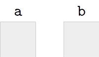

If we assign a value to variable ``a``:

.. python-run::

   a = 42

Then the position in memory represented by variable ``a`` will now contain 
the value 42:

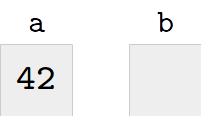

If we now assign the value of variable ``a`` to ``b``:

.. python-run::

   b = a

Then ``b`` will contain the same value as ``a``:

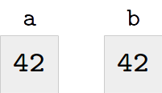

However, each variable will still represent distinct positions in memory, which
means that if we modify ``a``:

.. python-run::

   a = 37

The value of ``b`` is not affected:

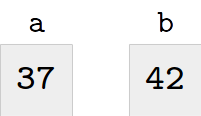

.. python-run::

   a
   b
   
To be more specific, Python *copied* the value of variable ``a`` and stored the 
copy in ``b`` during the ``b = a`` assignment.

Lists, on the other hand, behave differently. Let's say we have two variables
``lst1`` and ``lst2`` and we assign a list to ``lst1``:

.. python-run::

   lst1 = [1, 2, 3, 4]
   
Unlike simple types like integers, the ``lst1`` variable (or, more
specifically, the location in memory it represents) doesn't contain the list
directly. Instead, it contains a *reference* to another location in memory
that contains the list. We represent this behavior pictorially with an arrow going from ``lst1``
to the list:

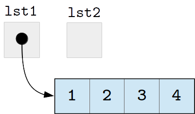

If we now assign ``lst1`` to ``lst2``:

.. python-run::

   lst2 = lst1

``lst2`` will point to the *same* list
as ``lst1``. In other words, assigning one list to another *does not*
create a copy of the list; it creates a copy of the *reference* to
the list, so that both variables point to the same list in memory:

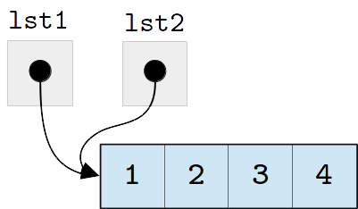

We refer to two (or more) variables that reference the same list as
*aliases* of each other.  The above assignment, for example, makes
``lst1`` and ``lst2`` aliases.

As a result of this sharing, changes made to a list through one
variable *will* affect the other variable. For example, if we modify
the first element of ``lst2``:

.. python-run::

   lst2[0] = 100
   lst2
   
We are modifying both the list referenced by ``lst2`` and the list
referenced by ``lst1``, because ``lst1`` and ``lst2`` refer to the
same list.

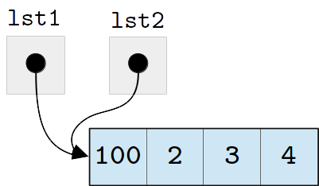

We can see that the change to ``lst2`` also changed ``lst1``:

.. python-run::

   lst1

This design makes comparing lists a bit tricky. Let's say we have the
following statements:

.. python-run::

   lst3 = [1, 2, 3, 4]
   lst4 = [1, 2, 3, 4]
   
After these assignments, ``lst3`` and ``lst4`` refer to separate
lists, which just happen to contain the same values:

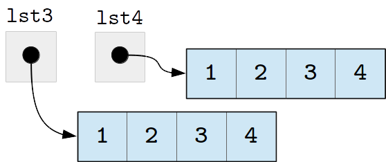

The equality operator (``==``) compares the contents of the lists, not
whether the variables contain references to the same list in memory,
and so, ``lst3`` and ``lst4`` are considered equal:

.. python-run::

   lst3 == lst4
   
The ``lst3`` and ``lst4`` variables themselves do contain different values
(since they point to different locations in memory, which just
happen to contain lists with the same values). We can actually see
these values (the location of the lists in memory) using the 
built-in ``id`` function:
 
.. python-run::

   id(lst3)
   id(lst4)
   id(lst3) == id(lst4)

Note: if you run this code yourself, you will very likely not see the
same ``id`` values shown above. The ``id`` value for ``lst3``,
however, should not be the same as the one for ``lst4``.

In contrast, the ``lst1`` and ``lst2`` variables we created earlier do have the
same ``id`` value, since they both refer to the same list in memory:

.. python-run::

   id(lst1)
   id(lst2)
   id(lst1) == id(lst2)

In some languages, such as C, the equality operator (``==``)
determines whether two variables refer to the same location in memory
and not whether the values of the two variables are the same.  This
type of equality is known as *reference equality*.  A test that
determines whether two variables have the same value is known as
*value equality*.  Python provides both types of equality.  The
standard equality operator (``==``) performs value equality, while the
``is`` operator performs reference equality.  Using the ``is``
operator, we could rewrite the above ``id`` examples as:

.. python-run::

   lst3 is lst4
   lst1 is lst2

Finally, in some cases, we may actually want to assign a *copy* of a
list to another variable. As noted earlier, we can just use
the slicing operator, since it will always return a new list. More
specifically, we specify the ``[:]`` slice (remember:
when we omit the starting and ending indexes, they default to zero and
the length of the list respectively). For example:

.. python-run::

   lst5 = [1, 2, 3, 4]
   lst6 = lst5[:]
   lst5
   lst6
   lst5 == lst6
   id(lst5) == id(lst6)
   lst5 is lst6
   
Notice that ``lst5`` and ``lst6`` end up pointing to *different* locations in memory
(which happen to contain lists with the same values). So, unlike ``lst1`` and ``lst2``,
if we were to modify an element in ``lst6``, ``lst5`` would not be affected:

.. python-run::

   lst5
   lst6
   lst6[0] = 100
   lst6
   lst5

The heap
--------

In the previous section, we explained that variables refer to lists
and that more than one variable can refer to the same list.  Where do
the lists actually reside in memory?  The answer is that lists (and
other compound data structures that we'll discuss in subsequent
chapters) reside in a part of memory known as the *heap*, which is
managed behind the scenes for you by a part of the Python runtime
system called the *garbage collector*.

The garbage collector allocates space in the heap when you create a
new list or add values to an existing list and it is responsible for
reclaiming space when it is no longer needed.

List parameters
---------------

In :ref:`chapter-functions`, we saw that Python functions use a type of parameter passing
called *call-by-value* where the arguments to a function are evaluated *before* the 
function is called and the resulting *values* are used to initialize fresh copies 
of the formal parameters.

However, we just saw that, when it comes to lists, the value of a list variable is
actually a *reference* to the list elsewhere in memory. This detail means that when
we call a function with a list parameter, it is this reference (and not a copy
of the list) that is used to initialize the formal parameters.

For example, suppose we want to write a function ``scale`` that takes a list ``lst`` and modifies
it in-place so that each value in the list is scaled by a given ``factor``.
We could write the function like this:

.. python-run::
   :formatting: separate

   def scale(lst, factor): 
       ''' 
       Multiplies the values in a list in-place by a specified factor.

       Inputs:
           lst: a list
           factor: the factor to multiply by

       Returns: None
       ''' 

       for i in range(len(lst)):
           lst[i] = lst[i] * factor

Earlier, we said that iterating over the range of indexes is
considered "not Pythonic", but this is one case where it
is justified, as we need to use the indexes of the list
to update it (just iterating over the values would not
allow us to do so). Later in the chapter we will see that
there is a built-in function called ``enumerate`` that is
generally preferred whenever we need to iterate over
both the indexes and values of a list.

Let's try out this function:

.. python-run::

   nums = [10, 20, 30, 40]
   scale(nums, 0.5)
   nums

The ``nums`` list *was* modified by the function ``scale``, which
seems to go against our previous warning that functions cannot modify
variables outside their scope. This seeming anomaly can best
understood by looking at what happens in memory.

Before the call to ``scale``, memory looks like this:

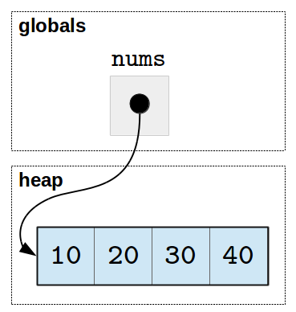

The variable ``nums`` resides in the space set aside for globals and
the list resides in the heap.

Once the call to ``scale`` is made, memory will look like this:

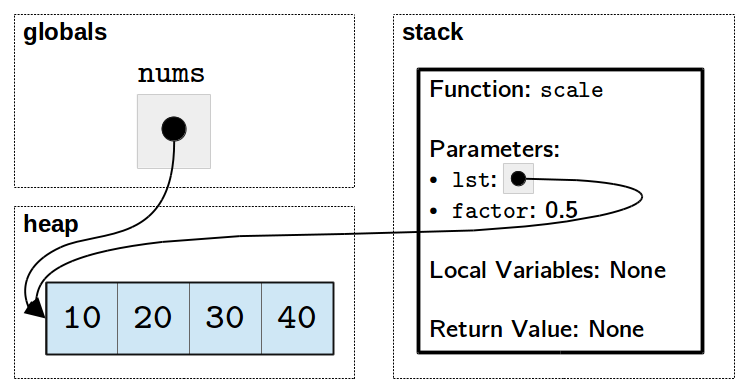

Notice that the ``lst`` parameter in the stack frame for ``scale``
refers to the same list (in the heap) as the global ``nums``.  (If you
skipped the :ref:`call-stack` section of :ref:`chapter-functions`, you
may want to revisit it now.)

Once the computation is finished and ``scale`` returns, the stack
frame goes away and we are left with ``nums`` and the modified list.

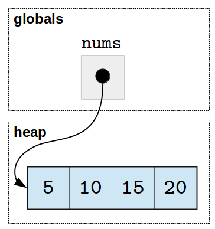

As the client of a function, you need to be mindful that when you pass
a list as a parameter to a function any changes made inside the
function will affect the original list.  If you write a function that,
like ``scale``, modifies a list in-place, make sure this behavior is
properly documented so that anyone using the function is aware that
the list that they are passing to the function will be modified.  In
general, it is considered poor style to modify a data structure as a
side effect of a function unless that is the stated purpose of the
function.

Next, since ``scale`` modifies the list in-place, it doesn't need to
return anything. However, we could write a similar version of
``scale`` that, instead of modifying the list in place, creates and
returns a new list, leaving the original list intact:

.. python-run::
   :formatting: separate

   def scale(lst, factor):
       ''' 
       Multiplies the values in a list by a specified factor.

       Inputs:
           lst: a list
           factor: the factor to multiply by

       Returns: a list of the same type as the input
       ''' 

       new_lst = []
       for x in lst:
           new_lst.append(x * factor)
       return new_lst

.. python-run::

   nums = [10, 20, 30, 40]
   scaled_nums = scale(nums, 0.5)
   nums
   scaled_nums

This version of ``scale`` uses a ``for``-loop and ``append`` to
construct the new list.  We can also write the function using list
comprehension:

.. python-run::
   :formatting: separate

   def scale(lst, factor):
       ''' 
       Multiplies the values in a list by a specified factor.

       Inputs:
           lst: a list
           factor: the factor to multiply by

       Returns: a list of the same type as the input
       ''' 

       return [x * factor for x in lst]

In both versions, a list is constructed in the heap and a reference to
the newly constructed list is returned.

This approach to passing and returning lists is efficient because the
value handed around is just a memory address.  We do not need to make
a full copy of the list every time it is passed as an argument or
returned as a result.  Of course, this efficiency comes at a cost: it
is easy to introduce hard-to-find bugs by unexpectedly modifying a
list passed as a parameter.

When taking lists as parameters to functions, you should:

* Be mindful that any changes you make to the list *will* have an effect outside the function's scope; 
* Think carefully about whether you want to modify the list in-place or return a new list with modified values; and finally,
* Record your choice in your function's docstring!

Lists of lists
--------------

The lists we have seen so far contain simple values like integers or strings,
but lists can, themselves, contain other lists. For example, the following
list contains three elements, each of which is a four-integer list:

.. python-run::

   m = [ [1,2,3,4], [5,6,7,8], [9,10,11,12] ]
   
Notice that, if we iterate over the list, we iterate over the three
lists that constitute the elements of the outer list (not the twelve
integers contained across the sublists).

.. python-run::
   
   for row in m:
       print(row)
       
Lists-of-lists are often used to represent matrices. For example,
list ``m`` could represent this matrix:

+---+----+----+----+
| 1 | 2  | 3  | 4  |
+---+----+----+----+
| 5 | 6  | 7  | 8  |
+---+----+----+----+
| 9 | 10 | 11 | 12 |
+---+----+----+----+

To access individual elements, we  use the square brackets
twice: once to specify the row, and again to specify the column:
       

.. python-run::
       
   m[1][2]
   m[2][0]
   
Similarly, we can assign values to individual elements using the square bracket notation:   

.. python-run::
   
   m[1][1] = 0
   m
   for row in m:
       print(row)

We can also nest lists even further. For example, we could use a 
"list-of-lists-of-lists" to represent a three-dimensional matrix:

.. python-run::
   
   m3d = [ [ [1,2], [3,4] ], [ [5,6], [7,8] ], [ [9,10], [11,12] ] ]
   
   for submatrix in m3d:
       for row in submatrix:
           print(row)
       print()

In the above example, ``m3d`` is a 3x2x2 matrix.

It is important, however, to understand that, even though we can use lists-of-lists
to manipulate data in a matrix-like way, the data is not stored internally as a matrix: it
is stored as a list with references to other lists, meaning that we can still access each individual
list:

.. python-run::
   
   m
   m[2]
   
Or modify these lists in a way that turns the data into something that is
*not* a matrix:

.. python-run::
   
   m[2] = "Foobar"
   m
   for row in m:
       print(row)

This representation can cause problems when we initialize a list
of lists. For example, we want to create a 5x5 matrix, with all elements
initialized to 0. For example, we might be tempted to use the ``*``
operator to create a row of five zeroes with 
``[0]*5`` and then repeat that five times, like this:

.. python-run::

   m = [ [0]*5 ] * 5 

At first, it may seem like this approach worked:

.. python-run::
   
   m
   for row in m:
       print(row)

However, something odd will happen if we try to modify an element of the
matrix:

.. python-run::

   m[2][3] = 10   
   m
   for row in m:
       print(row)
       
What happened here? When we created the list ``m``, we actually initialized
all five positions of ``m`` to point to the same list (``[0, 0, 0, 0,
0]``). Basically, the expression ``[0]*5`` produced one list,
but then using ``*`` again didn't create five copies of this list: it
created five copies of the *reference* to the list, which we can
depict as follows:

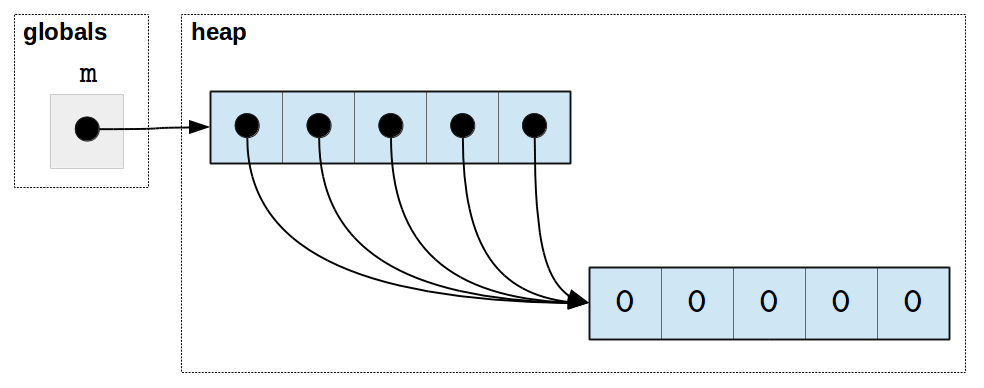

As a result, updating one "row" of the matrix actually updates them
all!  If this explanation of why the rows of ``M`` all refer to the
same list is confusing, please re-read the 
:ref:`section-variables-revisited` section.

Instead of using multiplication on a nested list to initialize the
matrix, we will use a loop:

.. python-run::

   m = []
   for i in range(5):
      m.append([0]*5)

Because the expression ``[0]*5`` is reevaluated in each iteration of
the loop, a new list of five zeros is constructed and then appended to
``m`` on every iteration.  The new version of ``m`` can be depicted as
follows:

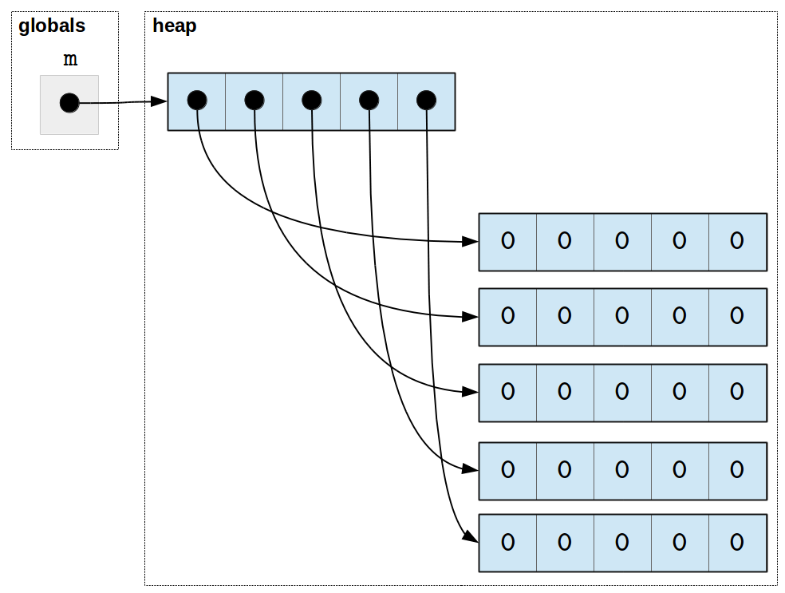

As we can see, modifying one row of ``m`` won't affect any other
row now:    
         
.. python-run::

   m[2][3] = 10   
   for row in m:
       print(row)

In sum, while lists-of-lists can be used to manipulate matrix-like
data, they must constructed used with care. 

The way Python stores the lists internally means that many matrix
operations (like matrix multiplication) can be quite inefficient. If
you find yourself needing to manipulate matrix-like data extensively
in your code (specially if you have to use higher-dimensional
matrices), you may want to consider using a library like `NumPy
<http://www.numpy.org/>`_, which is specifically optimized for
manipulating matrices and vectors, and which we will cover later in
the book.

Shallow copy versus deep copy
-----------------------------

Earlier in the section, we saw how to use slicing to make a copy of a
list:

.. python-run::

   lst = [1, 2, 3]
   lst_copy = lst[:]
   lst == lst_copy
   lst is lst_copy

This mechanism is very useful, but only does a shallow copy of the
list.  That is, it copies the values in the list.  If the copied value
is a reference to a list, the reference is copied, not the list
itself.

This design is efficient, but can lead to unexpected sharing.  For
example, let's recreate our matrix of zeros and then make a shallow
copy:

.. python-run::

   m = []
   for i in range(5):
      m.append([0]*5)

   m_shallow = m[:]

The result can be depicted as follows:

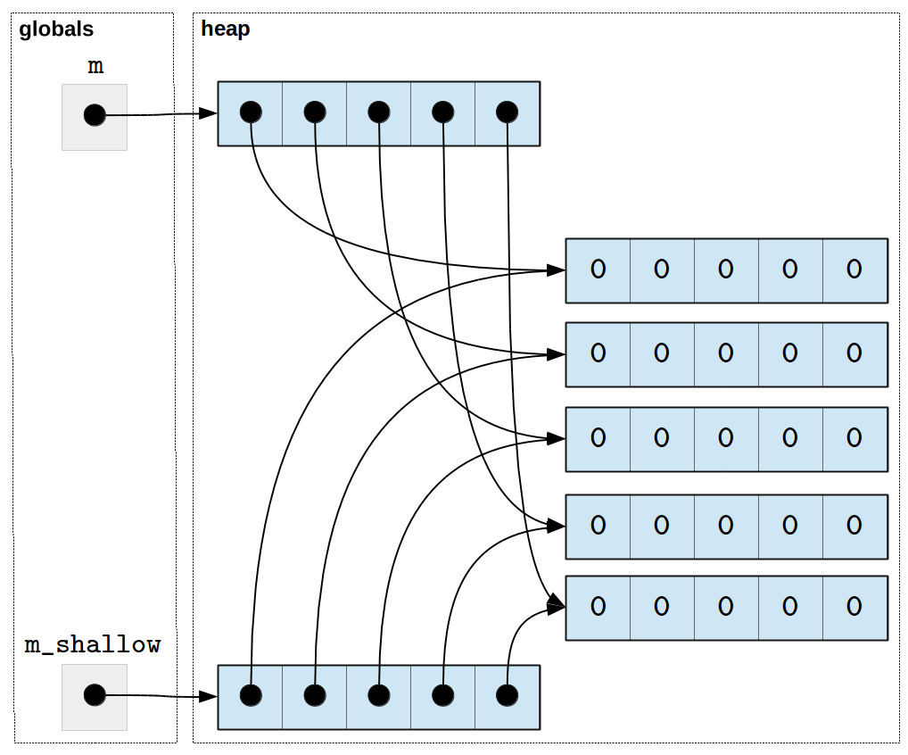

Notice that while the top-level level lists are different, they refer
to the same sub-lists.  We can verify this behavior using the ``is``
operator, which us whether two elements refer to the *same* location
in the heap.

.. python-run::

   m is m_shallow

   for i in range(len(m)):
       print(i, m[i] is m_shallow[i])

The ``copy`` library provides a function called ``deepcopy`` that can
be used when your application needs to avoid sharing between the
original and the copy.

	 
.. python-run::

   import copy

   m_deep = copy.deepcopy(m)

   for row in m_deep:
       print(row)

   m is m_deep

   for i in range(len(m)):
       print(i, m[i] is m_deep[i])

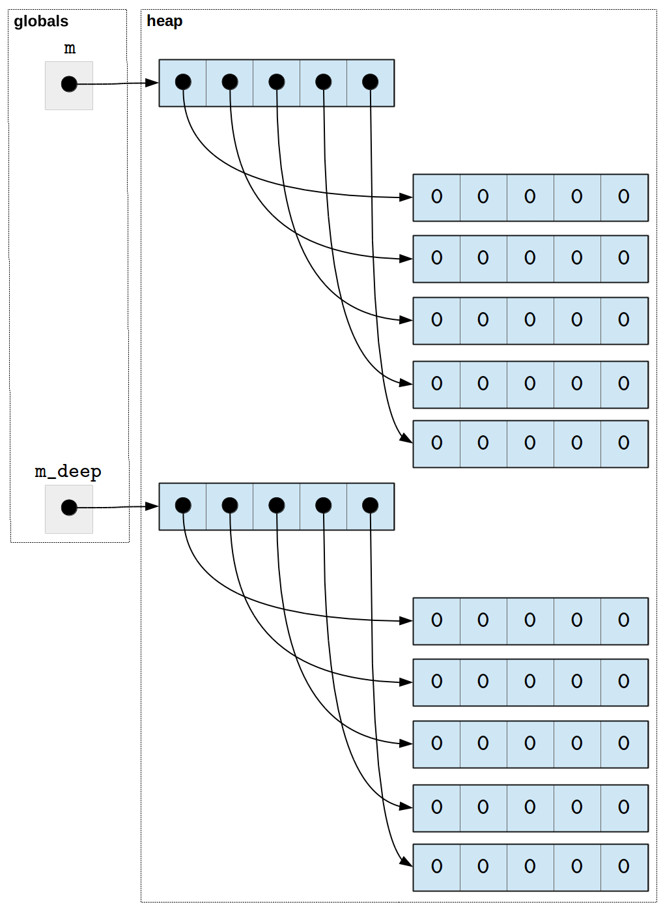

The deep copy function needs to be used with care; it will get stuck
in an infinite computation, if it is called on a data structure that
loops back onto itself, such as:

.. python-run::

   list_with_cycle = [1, 2, 3]
   list_with_cycle.append(list_with_cycle)

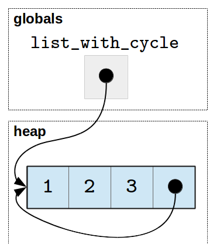

Tuples
------

Tuples, another data structure available in Python, are very similar
to lists. We can use them to store sequences of values and can create
tuple literals in the same way we create list literals, except using
parentheses instead of square brackets:

.. python-run::

   t = (100, 200, 300)
   t
   
We include a trailing comma in tuples of length one to to distinguish
tuples from expressions that happen to be surrounded by
parenthesis.  Note, for example, the difference in the type of ``t``
versus the type of ``e`` in the following code:

.. python-run::

   t = (1,)
   type(t)

   e = (1)
   type(e)

Many of the operations available on lists are also available on tuples:

.. python-run::

   t = (100, 200, 300)
   len(t)
   t[2]
   max(t)
      
However, tuples differ from lists in one crucial way: they are
*immutable*, which means that, once a tuple is created, its contents
cannot be modified.

For example, we cannot assign a new value to an element of a tuple:

.. python-run::

   t[1] = 42
   
Nor can we append to a tuple, delete from a tuple, or carry out any
operations that would modify a tuple in-place:

.. python-run::

   t.append(42)
   del t[1]
   t.sort()  

Despite this limitation, tuples are commonly used, especially to
return multiple values from a function and to represent related data
with different types, such as a person's name and salary (``("Alice",
5000)``). Here's an example of using a tuple to return multiple
values:

.. python-run::
   :formatting: separate

   import math
   def compute_basic_stats(nums): 
       ''' 

       Compute the mean and standard deviation of a list of numbers.

       Inputs:
         lst: list of numbers

       Returns: tuple with the mean and standard deviation.  
       '''

       mean = sum(nums) / len(nums)
       sqdiffs = [(x - mean) ** 2 for x in nums]
       stdev = math.sqrt(sum(sqdiffs) / len(nums))
       return (mean, stdev)

We can call this function with a list of numbers, assign the result
to a variable, and then extract the results by indexing:

.. python-run::
   :formatting: separate

   quiz_scores = [9.9, 10.0, 7.6, 6.6, 12.0, 7.8, 11.0, 7.3, 7.4, 9.2]
   stats = compute_basic_stats(quiz_scores)
   print("Mean:", stats[0])
   print("Standard deviation:", stats[1])

While this approach works, the resulting code is a bit cryptic.  We
could clean it up a bit by introducing named constants, such as
``MEAN_SLOT`` and ``STDEV_SLOT``, for the different slots in the
tuple and using them in place of the slot numbers.

   
.. python-run::
   :formatting: separate

   MEAN_SLOT = 0
   STDEV_SLOT = 1
   stats = compute_basic_stats(quiz_scores)
   print("Mean:", stats[MEAN_SLOT])
   print("Standard deviation:", stats[STDEV_SLOT])

Better yet, we can give names to the individual values directly using
Python's tuple *unpacking* mechanism, which allows programmers to
specify multiple names, separated by commas, on the left side of an
assignment statement and an expression that yields a tuple on the
right side.  Here's a sample call to ``compute_basic_stats`` that uses
this mechanism to give names to the components of the return value:

.. python-run::

   quiz_mean, quiz_stdev = compute_basic_stats(quiz_scores)

When unpacking a tuple, the number of names must match the number of
values in the tuple.  Python will throw a ``ValueError`` exception if
the number of names does not match the length of the tuple:

.. python-run::

   a, b = (1, 2, 3)

   a, b, c = (1, 2)

Tuple unpacking can also be used in ``for`` loops.  For example,
suppose we want to represent salary information for a small company.
While we could represent this data using a list of lists, it is more
common in Python to use a tuples to represent related data with
different types:

.. python-run::

   salaries = [ ("Alice", 5000), ("John", 4000), ("Carol", 4500) ]
   
We could iterate over the list in the usual way and use indices to
extract values as needed in the body of the loop:

.. python-run::

   for item in salaries:
       name = item[0]
       salary = item[1]
       print(name, "has a salary of", salary)

We can also use tuple unpacking in the ``for`` statement itself for
this purpose:

.. python-run::

   for name, salary in salaries:
       print(name, "has a salary of", salary)
       
In the example above, the ``for`` loop will iterate over each element
of ``salaries`` and, because we specified multiple variable names before the
``in``, Python will assume that each element of ``salaries`` contains a
tuple (or list) with two elements and will assign the first
element to ``name`` and the second element to ``salary``.

Note that this loop will fail if we have even a single tuple in the
list with a different number of elements:

.. python-run::

   salaries = [ ("Alice", 5000), ("John", "Smith", 4000), ("Carol", 4500) ]

   for name, salary in salaries:
       print(name, "has a salary of", salary)

Another use of tuple unpacking in for loops arises when we need to use
both the values and their indices when iterating over a list.  You can
now see that our earlier introduction of ``enumerate`` (shown again
below) made use of tuple unpacking: ``enumerate`` yields a list of
(index, value) tuples and the loop header supplies two names (``i``
and ``price``) to hold the components of the tuple as it is
processed in the body of the loop.

.. python-run::
   :formatting: separate

   prices = [10, 25, 5, 70, 10]

   for i, price in enumerate(prices):
       tax = 0.10 * price
       total = price + tax
       print("The price (with tax) of element", i, "is", total)

.. _section-strings:

Strings
-------

Back in :ref:`chapter-basics` we introduced one of the basic data types
in Python: strings. Strings allow us to store "text" or, more concretely, sequences (or
"strings") of characters:

.. python-run::

    s1 = "foobar"
    s2 = 'foobar'

As it turns out, string have some similarities to lists.
Most notably, individual characters of a string can be accessed
in the same way as elements in a list, using square brackets:

.. python-run::

   s1[0]

We can also extract slices of a string:

.. python-run::

    s1[1:4]

Strings, like tuples, are immutable, so we cannot modify individual
characters in a string:

.. python-run::

   s1[0] = 'F'

String formatting
~~~~~~~~~~~~~~~~~

So far, whenever we had to print a combination of strings and other values,
we would just use the ``print`` function, which prints its parameters
separated by spaces:

.. python-run::

   a = 37
   print("Here is a number:", a)
   
Strings also have a ``format`` method that allows us to combine values
into a string in many different ways. When using this method, we
include curly braces (``{}``) in any place where we want to embed
another value.  For example:

.. python-run::

   s = "Here is a number: {}"

Then, we call the ``format`` method, and pass the value (or values) we
want to embed in the string as a parameter (or parameters):

.. python-run::

   s.format(a)
   s.format(100)
   s.format(3.1415)
   s.format("Not a number, but this still works")
   
Note how ``format`` returns a new string; it does not modify
the format string itself. If we want to print the resulting string, we can 
pass the return value of ``format`` to ``print``:

.. python-run::

   print(s.format(a))

In practice, it is common to call ``format`` directly on a string literal. This usage may
look weird at first, but it is no different from calling ``format`` on a string variable:

.. python-run::

   "Here is a number: {}".format(42)
   
We can also embed multiple values into the string:

.. python-run::

   a = 5
   b = 7
   print("{} times {} is {}".format(a, b, a*b))

And we can also control the way in which the embedded values are formatted.
For example, when embedding a float, we can write ``{:.Nf}``, substituting 
the number of decimal places we want to print for ``N``:
    
.. python-run::

   PI = 3.141592653589793
   print("The value of pi is {:.2f}".format(PI))
   print("The value of pi is {:.4f}".format(PI))

There are many more ways to format strings with ``format``. You can
see the full description of how to specify formats for different types
of values in the `Python documentation
<https://docs.python.org/3/library/string.html#formatstrings>`__ for
this method

Other operations on strings
~~~~~~~~~~~~~~~~~~~~~~~~~~~

Like lists, Python provides a large number of functions and methods to operate on strings. For example, we can use the ``in``
operator to determine whether a given string is contained within
another string:

.. python-run::

   s1 = "foobar"
   "oo" in s1
   "baz" in s1

If we want to find the location of a substring in a string, we can use
the ``find`` method:

.. python-run::

   s1 = "foobar"
   s1.find("oo")
   s1.find("baz")

If the substring provided to ``find`` is found in the string, the
method will return the index of the first occurrence of that
substring.  If the string does not contain the provided substring,
then the method returns ``-1``.  Since ``-1`` is a legal index,
it is important to check the return value of this method before you
use it!

We also have methods that transform the strings in various ways:

.. python-run::

    "FOOBAR".lower()
    "foobar".upper()
    "hello world".capitalize()
    "1.000.000".replace(".", ",")
    "   hello   world \t  \n".strip()

While most of these functions are self-explanatory, the last one may
not be: it constructs a new string that omits any leading or trailing
white space (i.e., spaces, tabs, newlines, etc) from the original.
    
Two methods that will come in handy as we start to work with more data are the
``split`` and ``join`` methods. The ``split`` method takes a string that contains 
several values separated by a delimiter, such as a comma or
a space, and returns a list of strings containing the values from the original string with the
delimiters removed. For example:

.. python-run::

   s = "foo,bar,baz"
   values = s.split(",")
   values
    
The parameter to ``split`` is optional; if we omit it, ``split`` will
assume that any whitespace characters (spaces, tabs, etc.) are the separator. For example:

.. python-run::

   phrase = "The quick   brown  fox     jumps  over   the  lazy            dog"
   words = phrase.split()
   words

Note that ``split`` will consider any amount of whitespace to be a single delimiter.
This behavior happens only when we call ``split`` without a parameter; when we specify 
an explicit parameter, multiple consecutive delimiters become "empty"
values (strings of length zero):

.. python-run::

   s = "foo,bar,,baz"
   values2 = s.split(",")
   values2

A similar method, ``join``, allows us to take a list of strings and concatenate
them using a given delimiter. For example:

.. python-run::

   values
   sep = "|"
   sep.join(values)
   
Note that, like the ``format`` method, we can call ``join`` directly on a string
literal:   
   
.. python-run::

   "|".join(values)

This section describes a small sample of what you can do with strings. To see
a full list of methods, see the `Python documentation <https://docs.python.org/3.4/library/stdtypes.html#string-methods>`__
or run ``help(str)`` from the Python interpreter.

.. todo::

   Does it make sense to add a section here about sequences in general?
