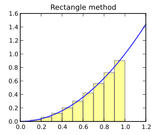

Functional Programming
======================

Programming languages are often classified into one of several
paradigms.  For example, in *imperative* programming languages,
computation is expressed as sequences of statements that update the
state of the computation, including control flow statements like
conditional and looping statements. In this context, "imperative" means "to give
commands" (where statements are commands that are 
"given" in a program). Python is an imperative programming language,
as are many others: C, C++, Java, etc.

We have also seen the *object-oriented (OO) paradigm*, where programs
manipulate objects encapsulating some data (their attributes)
and operations on the objects (their methods). Languages like
Java are known as pure OO languages, because we *must* use classes
and objects everywhere in our program. Python, along with C++ and
others, is a multi-paradigm language: we can use OO features,
but can stick with just imperative constructs if we like. 
   
Another major paradigm of programming languages is the *functional*
paradigm, in which functions are primarily used to compute values, rather
than for their side effects (e.g., updating variables, printing).  
Functional programming languages include LISP, Scheme, Haskell,
SML, and others. Python is not a pure functional language, but it does
support a number of features commonly found in functional programming
languages that are not traditionally found in languages like
C, C++, Java, etc. (although some of these languages are starting to
include features that are influenced by functional programming languages).

In this chapter, we will focus on two aspects of functional
programming that Python supports: higher-order functions and anonymous
functions.

Higher-order functions
----------------------

Let's say we wanted to find the value of an integral:

.. math:: \int_{10}^{20} x^2\,dx

One way to do this is to apply integration rules, which tell us
that the antiderivative of :math:`x^2` is :math:`\frac{x^3}{3}`:

.. math:: \int_{10}^{20} x^2\,dx = \left[\frac{x^3}{3}\right]_{10}^{20} = \frac{20^3}{3} - \frac{10^3}{3} = \frac{8000}{3} - \frac{1000}{3} = \frac{7000}{3} = 2333.\overline{3}

While it is possible to write a program that 
applies integration rules to evaluate a given integral, programs more
commonly evaluate integrals using 
*numerical methods*, or ways to approximate
the value of the integral.

A common numerical method for computing integrals is the *rectangle method*,
in which the area under the curve is approximated by :math:`N`
rectangles. If we are computing the integral between :math:`a` and
:math:`b`, then the width of each rectangle will be:

.. math:: \Delta=\frac{b - a}{N}

We can then approximate the integral as follows:

.. math:: \int_{a}^{b} f(x)\,dx \approx \sum_{i=0}^{N-1} \Delta \cdot f\left(a + \Delta \cdot (i+0.5)\right)
   
In other words, we divide the range between :math:`a` and :math:`b` into :math:`N` 
subranges, all of width :math:`\Delta`. For each subrange, we compute the area of
a rectangle, where the height of the rectangle is simply the value of
the function at the midpoint of the subrange (using the start or end of the 
subrange is not desirable for reasons that are not worth getting into here) The 
sum of the areas of all those rectangles approximates the value of the
integral between :math:`a` and :math:`b`.

We can easily write a function that implements this approach. Let's assume the
function we're integrating is the square function:

.. python-run::
   :formatting: separate

   def square(x):
       return x ** 2

Our integration function, which simply implements the above summation
using a ``for`` loop, would look like this:

.. python-run::
   :formatting: separate

   def integrate_square(lb, ub, N): 
       ''' 
       Compute the integral of the square function between the
       specified bounds using the rectangle method.

       Inputs:
         lb (float): lower bound of the range
         ub (float): upper bound of the range
         N (int): the number of rectangles to use

       Returns (float): an approximation of the area under the curve
         between the specified bounds.
       '''

       delta = (ub - lb) / N
       sum = 0
       for i in range(N):
           sum += delta * square(lb + delta * (i + 0.5))
       return sum

If we run this function with ``N`` equal to 100, we get a reasonable approximation to
the expected value of the integral (:math:`2333.\overline{3}`)

.. python-run::

   integrate_square(10.0, 20.0, 100)

And, as we divide the area under the function into more rectangles, we
get more accurate results, at the expense of more computation:

.. python-run::

   integrate_square(10.0, 20.0, 1000)
   integrate_square(10.0, 20.0, 10000)
   integrate_square(10.0, 20.0, 100000)

But what if we want to compute the integral of other functions? We would
need to create functions that repeat essentially the same code! So,
to integrate :math:`f(x)=2\cdot x` we would have to write the following:

.. python-run::
   :formatting: separate

   def double(x):
       return 2 * x

   def integrate_double(lb, ub, N):
       ''' 
       Compute the integral of the double function between the
       specified bounds using the rectangle method.

       Inputs:
         lb (float): lower bound of the range
         ub (float): upper bound of the range
         N (int): the number of rectangles to use

       Returns (float): an approximation of the area under the curve
         between the specified bounds
       '''

       delta = (ub - lb) / N
       sum = 0
       for i in range(N):
           sum += delta * double(lb + delta * (i + 0.5))
       return sum

.. python-run::

   integrate_double(10.0, 20.0, 10000)

If we compare ``integrate_square`` and ``integrate_double``, we can
see that they are identical except for the call to the function
that is being integrated. In Python, and in most functional
programming languages, we address this code duplication by writing
a general purpose ``integrate`` function that, instead
of integrating a specific hard-coded function, takes
a function *as a parameter*:

.. python-run::
   :formatting: separate

   def integrate(fn, lb, ub, N):
       ''' 
       Compute the integral of the specified function between the
       specified lower and upper bounds using the rectangle method.

       Inputs:
         fn (function): function to be integrated.  Must take a float
           and return a float
         lb (float): lower bound of the range
         ub (float): upper bound of the range
         N (int): the number of rectangles to use

       Returns (float): an approximation of the area under the curve
         (specified by the function parameter) between the bounds.
       '''

       delta = (ub - lb) / N
       sum = 0
       for i in range(N):
           sum += delta * fn(lb + delta * (i + 0.5))
       return sum

A call to this function looks like:

.. python-run::

   integrate(square, 10.0, 20.0, 10000)

Notice that ``integrate`` is nearly identical to both ``integrate_square`` 
and ``integrate_double``, except we have added a parameter called ``fn`` 
that must be a function. When we call ``integrate``, we are passing
the ``square`` function itself (not the result of calling ``square``
with some specific values).

Because ``integrate`` takes a function parameter, we refer to it as
a *higher-order function*. A higher-order function is any function that takes
another function as a parameter or, as we'll see later on, returns
a function as its result. Notice that we don't define
higher-order functions in any special way; the syntax is the same as what 
we've seen so far. 

So, since the function to be integrated is now a parameter to ``integrate``,
integrating a different function is as simple as calling
``integrate`` with the function we want to integrate: 

.. python-run::

   integrate(double, 10.0, 20.0, 10000)

We can also use functions included with Python:

.. python-run::

   import math
   integrate(math.sqrt, 10.0, 20.0, 10000)

Note that ``integrate`` will only work if we pass it a function that takes
a single float parameter and returns a float value. If we pass any other
type of function, our code will fail:

.. python-run::
   :formatting: separate

   def multiply(a, b):
      return a*b
 
.. python-run::

   integrate(multiply, 10.0, 20.0, 10000)     

The exact type of failure will depend on the function.  In this case,
for example, we passed a function with two required parameters where a
function of one parameter was needed.
  

Anonymous functions
-------------------

The ``integrate`` function can take a function as a parameter, but it
requires defining a separate function (like ``square`` and ``double``)
to pass as a parameter.  Instead of defining a function just for the
purposes of passing it as a parameter to another function, we can
instead use *anonymous functions* (also known as *lambdas*). An
anonymous function is basically a function we define on the fly
without using the ``def`` statement to give it a name. For example,
here is an anonymous function to compute the square of a single
parameter ``x``:

.. python-run::
   :formatting: separate

   lambda x: x ** 2
   
And here is an anonymous function to add two parameters ``x`` and ``y``:

.. python-run::
   :formatting: separate

   lambda x, y: x + y
   
The general syntax of an anonymous function is the following:

.. parsed-literal::

    **lambda** *<parameters>*: *<expression>*
    
Notice that anonymous functions contain a single expression. They don't
contain statements like a regular function (so you cannot use
conditional statements or loops), nor do they have a ``return`` statement. The
value the function will return is simply the result of the evaluating
the expression specified in the ``lambda`` using the values supplied
for the parameters.

And, since they're anonymous, functions defined using ``lambda`` need
to be given a name before they can be called.  Anonymous functions are
most commonly used as parameters to other functions.  For example, the
following piece of code is equivalent to passing the ``square``
function to ``integrate``:

.. python-run::

   integrate(lambda x: x ** 2, 10.0, 20.0, 10000)

And the following piece of code is equivalent to passing the ``double`` function:

.. python-run::

   integrate(lambda x: 2 * x, 10.0, 20.0, 10000)

map(), reduce(), filter()
-------------------------

Python provides a few very useful higher-order functions for working with
lists.

Let's say we had the following list:

.. python-run::
   :formatting: separate

   lst = [1, 2, 3, 4, 5]
   
If we wanted to create a new list that contains the above values,
but with each value incremented by one. We could do it like this:

.. python-run::
   :formatting: separate

   lst2 = []
   for x in lst:
       lst2.append(x + 1)
       
.. python-run::

   print(lst2)      

Functional programming languages provide a different mechanism
for processing lists in this way. In fact, most functional programming
languages lack looping constructs like ``for`` or ``while`` and, instead,
provide mechanisms to apply functions to sequences of values
in different ways (in the next chapter we will also see the general
mechanism that functional programming languages use to repeat operations: *recursion*)

For example, if we wanted to increment each value of the list by one,
we would define a function that increments a single value:

.. python-run::
   :formatting: separate
    
   def incr(x):
       return x + 1

Then, we would call that function on each value of the list, and
place the resulting values in a new list. However, instead of doing
this task with a ``for`` loop, we can do it with a single call to
the built-in ``map`` function

.. python-run::
   :formatting: separate
    
   map(incr, lst)

The return value of this call is actually not a new list, but rather
an iterable object (like the kind of value that we get from a call to
``range``) that we can then use in a ``for`` loop or any other
context, such as a call to ``map``, that requires an iterable, or
which we can convert to a new list:

.. python-run::

   for x in map(incr, lst):
       print(x)
   lst2 = list(map(incr, lst))
   lst2

As we saw with the ``integrate`` function, we don't need to define
a new function before calling ``map`` and, instead, we can just
use an anonymous function as the first parameter to ``map``:

.. python-run::

   lst
   list(map(lambda x: x * 2, lst))
   lst
   list(map(lambda x: x ** 2, lst))
   lst
   
Notice that ``map`` does not change the list it operates on.

If we would like to create a new list with elements copied from an
input list *only* if they meet a given condition, we can instead use the
built-in ``filter`` function.  This function takes a function that
returns a boolean result and a list as arguments. If, for a given
value in the list, the supplied function returns ``True``, then the
value will be included in the resulting list. For example:

.. python-run::
   :formatting: separate

   def is_odd(x):
       return x % 2 == 1

.. python-run::

   lst
   list(filter(is_odd, lst))

Or, equivalently:

.. python-run::

   list(filter(lambda x: x % 2 == 1, lst))

Another useful function found in many functional programming
languages is the ``reduce`` function. Unlike ``map`` and ``filter``,
it does not apply a function to each value in the list; instead,
it repeatedly applies the function to reduce the list to a single value. For example, say we had
the following list:

.. python-run::
   :formatting: separate

   lst = [1, 2, 3, 4]
   
If we wanted to multiply all the values in the list, we could
write the following loop: 

.. python-run::
   :formatting: separate

   p = lst[0]
   for x in lst[1:]:
       p = x * p

   print(p)
   
Notice that this code boils down to evaluating this expression:

.. python-run::

   ((lst[0] * lst[1]) * lst[2]) * lst[3]
   
If we define a ``multiply`` function, we could rewrite this expression
as follows:

.. python-run::
   :formatting: separate
   
   def multiply(x, y):
      return x * y
      
.. python-run::
   
   multiply(multiply(multiply(lst[0], lst[1]), lst[2]), lst[3])
   
And this repeated application of a function is exactly what ``reduce`` does:

.. python-run::

   from functools import reduce

   reduce(multiply, lst)      

Notice that unlike ``map`` and ``filter``, ``reduce`` needs to be
imported from the ``functools`` library.

Or, using a ``lambda``:

.. python-run::

   reduce(lambda x, y: x * y, lst)

.. _list_comprehensions_revisited:

List comprehensions revisited
~~~~~~~~~~~~~~~~~~~~~~~~~~~~~

In :ref:`chapter-lists`, we briefly described *list comprehensions*
as shorthand notation for producing a new list based on an
existing list. In particular, the following piece of code:

.. python-run::
   :formatting: separate

   original_list = [1, -2, 3, 4, -5]
   new_list = []
   
   for x in original_list:
       if x > 0:
           new_list.append(x ** 2)

   print(new_list)
           
           
Can be written more compactly using a list comprehension:

.. python-run::
   :formatting: separate

   new_list = [x ** 2 for x in original_list if x > 0]
   print(new_list)

Another way of thinking about list comprehensions is that they are a
more readable notation for combining a ``map`` and ``filter`` on a
list. The above list comprehension is equivalent to this code:

.. python-run::
   :formatting: separate

   new_list = list(map(lambda x: x**2, filter(lambda x: x>0, original_list)))
   print(new_list)

Returning a function
--------------------

Recall that we defined higher-order functions as functions that can
take other functions as arguments and return functions as results.  So
far, we've seen how higher-order functions can take a function as a
parameter.  In this section, we explain how to write functions that
return new functions as results.  For example, let's say that, given
an arbitrary function, :math:`f` that takes a single float and returns
a float, we want to compute a new function to give us the value of the
derivative of :math:`f` at a given point.  In other words, the end
result would look something like this:

.. python-run::
   :formatting: separate
   
   def square(x):
       return x ** 2   

.. code:: python

   >>> square(9)
   81
   >>> square_prime = derivative(square)
   >>> square_prime(9)
   18
   
Notice that the ``derivative`` function returns a function that we can
then call later in our code. ``square_prime`` is a variable, but one that refers
to a new function (instead of containing a value like an integer, or
referring to a list or dictionary).  Furthermore, note that we want the
``derivative`` function to work for *any* arbitrary function, so we
should also be able to write code like this:

.. code:: python

   >>> cube_prime = derivative(lambda x: x ** 3)
   >>> cube_prime(3)
   27

To explain how to do this, let's start by explaining how we can compute
the derivative of a single function. As we did with integration, we will 
compute the value of the derivative *numerically*.

The derivative of a function :math:`f` at point :math:`x` is its slope
at that point. We can approximate the slope by computing the value :math:`f(x)`
and the value of the function at a nearby point :math:`f(x + dx)`:

.. math:: f'(x) = \frac{f(x+dx)-f(x)}{dx}

In calculus, you consider the limit as :math:`dx` goes to zero. Here we
will just assume :math:`dx` is a small value like ``0.00001``.

So, if we had the following function:

.. python-run::
   :formatting: separate

   def cube(x):
       return x ** 3

We could follow the above definition to define its derivative like this:

.. python-run::
   :formatting: separate
    
   def cube_slope(x, dx=0.00001):
       '''
       Compute the slope of the cube function at the specified point.

       Inputs:
         x (float): point at which to evaluate the slope
         dx (float): difference (default: 0.0001)

       Returns (float): approximation to the slope of the cube
         function at the input point.
       '''

       return (cube(x + dx) - cube(x)) / dx

.. python-run::

   cube(10)
   cube_slope(10)

The derivate of :math:`x^3` is :math:`3x^2`, so we are correctly approximating
its slope (which would be 300 at :math:`x=10`).

Now, if we wanted to compute the derivative for a different function, the resulting functions
would look very similar:

.. python-run::
   :formatting: separate

   def square(x):
       return x ** 2
  
   def square_slope(x, dx=0.00001):
       '''
       Compute the slope of the square function at the specified point

       Inputs:
         x (float): point at which to evaluate the slope
         dx (float): difference (default: 0.0001)

       Returns (float): approximation to the slope of the square
         function at the input point.
       '''

       return (square(x + dx) - square(x)) / dx

One first approach at generating this code could be to create a
general purpose ``slope`` function, like we did with our integration
function:

.. python-run::
   :formatting: separate

   def slope(f, x, dx=0.00001):
       '''
       Compute the slope of the specified function at the specified
       point

       Inputs:
         f (function): function to take the slope of.  The function
           must a float and return a float
         x (float): point at which to evaluate the slope of f.
         dx (float): difference (default: 0.0001)

       Returns (float): approximation to the slope of the specified
         function function at the input point.
       '''

       return (f(x + dx) - f(x)) / dx

.. python-run::

   slope(cube, 10)
   slope(square, 10)

However, we actually want to generate *new* functions (so we don't have to pass
``cube`` or ``square`` as a parameter every time we want to compute its derivative). 
We do this by defining
one function *inside* another function, and having the outer function return
the inner function:

.. python-run::
   :formatting: separate

   def derivative(f):
       ''' 
       Create a function of one variable that computes the derivative
       of the specified function.

       Inputs:
         fn (function): function to be differentiated.  Must take a
           float and return a float

       Returns: a function that computes the derivative of the
         specified function at a given point with an optional
         parameter for dx.
       '''

       def slope(x, dx = 0.00001):
           ''' Compute the slope of f at the specified point '''

           return (f(x + dx)-f(x)) / dx
        
       return slope
       
In this case ``slope``, the inner function, is the function we want to generate. 
Notice that it does not need to take a function as a parameter. Instead, because it 
is in the same scope as the parameter ``f``, it can access ``f`` directly. The outer
function, ``derivative``, takes a function parameter and will return a ``slope``
function that will use that function to compute the slope.       

.. python-run::

   cube_prime = derivative(cube)
   cube_prime(2)
   cube_prime(5)
   cube_prime(5, dx=0.0000001)
   quad_prime = derivative(lambda x: x ** 4)
   quad_prime(3)

Because the derivative of a function of one variable, is itself a
function of one variable, we can apply our derivative function
repeatedly to get functions that compute the second derivative, third
derivative, etc.

.. python-run::

   cube_prime = derivative(cube)
   cube_double_prime = derivative(cube_prime)
   cube_triple_prime = derivative(cube_double_prime)

   cube_prime(10)
   cube_double_prime(10)
   cube_triple_prime(10)

Scoping and inner functions
----------------------------

Before we move on to our next topic, recursion, let's revisit the
topic of scoping.  Recall that every variable is defined and
accessible within a specific part of the program, known as the variable's scope.
Our earlier discussion (see :ref:`chapter-functions-variable-scope`) covered local variables,
which have scope that is local to a specific function and global
variables, which are defined outside the context of any function.
Adding inner functions to the mix introduces in a third kind of scope:
*nonlocal*.  A local variable or parameter in an outer function, such
as the parameter ``f`` in our ``derivative`` function, is visible as a
nonlocal variable in an inner function as long as it is not *shadowed*
by a variable or parameter of the same name in the inner function.
Like globals, nonlocal variables are read-only within an inner
function unless the programmer explicitly declares them as
``nonlocal``.

.. todo:: Is this explanation sufficient or do we need to expand it to include a discussion of environments and nesting?

