Trees
=====

In the previous chapter, we introduced recursion as a different
way of repeating operations, allowing us to write *recursive algorithms*
to solve certain problem. Some data structures, like the *tree*
data structure we will discuss in this chapter, also rely on recursion
and, specifically, the definition of the data structure itself
is recursive.

A *tree* is a recursively-defined data structure that has multiple
applications in computing. Informally, we can think of it as a root
node that has multiple nodes as "branches", and where each of these
nodes, in turn, can have "branches" of its own. More formally, a tree is
a rooted acyclic undirected graph. For example, this is a tree:

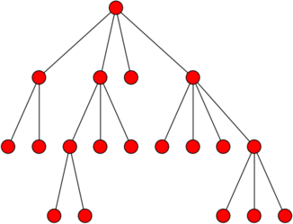

Notice how there is a root node at the top (unlike real trees, computer
trees are drawn with the root at the top), and this node has four
"child" nodes. The right-most child node, in turn, has four child nodes
of its own. Etc.

But why is this a recursively-defined data structure? If we look just
at the right-most child node of the root node, we could "prune" it from
the root and it would still be a tree:

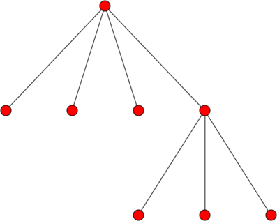

So, informally, a tree is a root node that is connected to other trees.
More formally, we could define a tree as...

    A node with :math:`0\ldots N` subtrees (or *children*).

Like a recursive algorithm, we have a base case and a recursive case.
The base case is when we encounter a node with 0 subtrees
(which is called a *leaf node*), and the recursive case is
when we encounter a node that has other trees as subtrees.

Under this definition, when :math:`N=2`, we
have what is called a **binary tree** (we will talk about these in more
detail later).

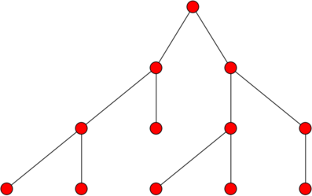

Finally, it is common for each node in a tree to have one or more associated values.
We will specifically consider each node to have an associated key/value pair.
As we'll see later on, there are certain algorithms that rely on trees
where each node's key is unique (but the value is not).

Using Trees
-----------

We are going to start by presenting trees as opaque data structures: for now,
we won't worry about their internal representation or  how they work internally, and will interact with them through an API. We provide
a ``tree`` module that contains a ``Tree`` class which we can use to work
with trees. You can find this module in our :ref:`example code <example-code>`
under `functions/trees/tree.py`.

.. python-run::
   :formatting: separate
   
   from tree import Tree

In particular, we will have access to the following methods:

.. code:: python

   # Create a tree with a root node with the given key/value pair, 
   # and no children. The key is required but the value is optional
   # (if ommitted, it will just be None)
   t = Tree(k,v)
   
   # Properties to access the key and value of a tree (for reading and writing)
   t.key
   t.value
   
   # Take an existing tree t2 and add it as a child to t 
   t.add_child(t2)
   
   # Read-only property that allows us to iterate over the 
   # children of a tree
   t.children
   
   # Read-only property that returns the number of children a tree has
   t.num_children
   
   # Plot or print a tree
   t.plot()
   t.print()

Let's create a tree (for now, we'll leave the values blank by setting
them to ``None``):

.. python-run::

   t = Tree("ROOT")

Right now, this tree is just a single node with no subtrees:

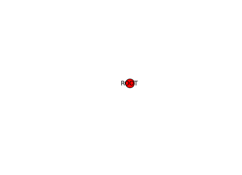

We can add a child subtree using the ``add_child`` method:

.. python-run::

   t1 = Tree("CHILD 1")
   t.add_child(t1)
   
And now we have the "ROOT" node with a single "CHILD 1" child node:

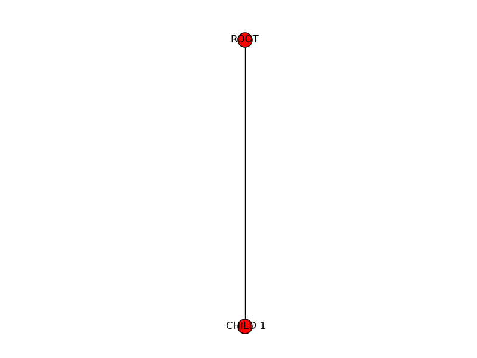

If we add two more children to the root:

.. python-run::

   t2 = Tree("CHILD 2")
   t3 = Tree("CHILD 3")
   t.add_child(t2)
   t.add_child(t3)

Then this starts looking more like a tree:

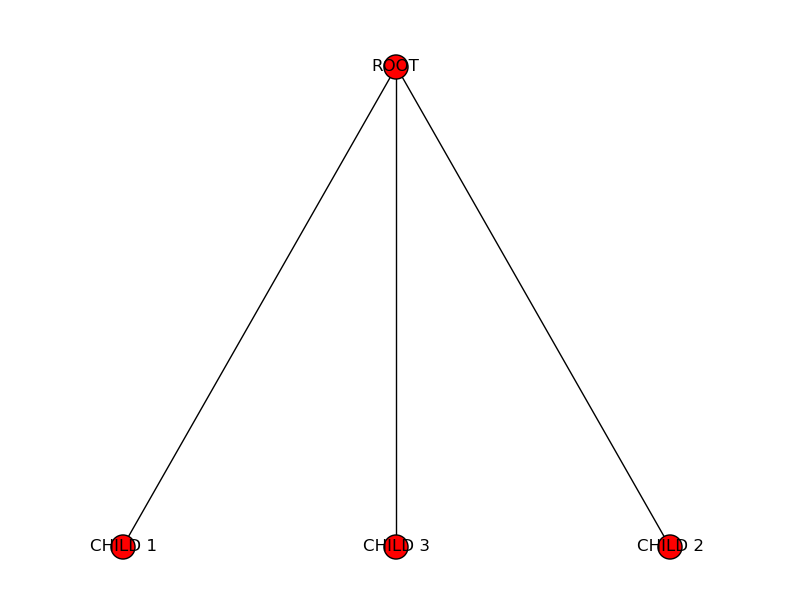

Finally, let's add more subtrees to the child trees
we just created:

.. python-run::

   t1.add_child( Tree("GRANDCHILD 1.1") )
   t1.add_child( Tree("GRANDCHILD 1.2") )
   t2.add_child( Tree("GRANDCHILD 2.1") )
   t3.add_child( Tree("GRANDCHILD 3.1") )
   t3.add_child( Tree("GRANDCHILD 3.2") )
   t3.add_child( Tree("GRANDCHILD 3.3") )

And the resulting tree looks like this:

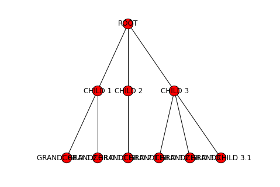

We can use the ``print`` method to get a text representation
of the tree:

.. python-run::

   t.print()

Notice how, if we call this method on ``t1`` (one of the children
of the ``t`` tree), we get only the root of ``t1`` and its children:

.. python-run::

   t1.print()

If we want to do this task for every child of ``t``, we can use the 
``children`` property to iterate over all of ``t``'s
child subtrees:

.. python-run::

   for st in t.children:
       st.print()
       print()

Now, let's say we want to write a function to process the contents
of a tree in some way. Because of their recursive nature, trees
are easier to process using a recursive algorithm. For example,
if we wanted to print the key of every node in the tree, we would use
the following function:

.. python-run::
   :formatting: separate

   def traverse(t):
       if t.num_children == 0:
           # BASE CASE: Leaf node. Print its key
           print(t.key)
       else:
          # RECURSIVE CASE: A node with at least one
          # subtree. Print the key of the tree's root
          # node, and then process the subtrees
          # recursively.
          print(t.key)
          for st in t.children:
              traverse(st)

.. python-run::

   traverse(t)
   
In this case, we defined a base case and a recursive case that
matches the recursive definition of the data structure: if we
encounter a leaf node, we just print its key and we don't need
to recurse further (because there are no subtrees) but, if we encounter
a tree with subtrees, we print the root node's key, and then recursively 
process the tree's subtrees.

We can also rewrite this algorithm like this:

.. python-run::
   :formatting: separate

   def traverse(t):
       print(t.key)
       
       for st in t.children:
           traverse(st)

.. python-run::

   traverse(t)

These two implementations accomplish the exact same thing, but the second
one doesn't explicitly separate the base case from the recursive case.
Instead, if implicitly prevents a recursive call from happening when
``t`` is a leaf node, because ``t.children`` will return an
empty list in this case (and ``traverse`` won't be called recursively,
since the body of the ``for`` loop will never be run).

Similarly, we can recursively compute the *height* of a tree, which is
the longest distance (in number of edges) from the root node to any leaf node.
For example, the height of this tree is three: 

.. python-run::

   tt = Tree("R")
   t1 = Tree("1")
   t2 = Tree("2")
   tt.add_child(t2)
   tt.add_child(t1)
   t11 = Tree("1.1")
   t12 = Tree("1.2")
   t13 = Tree("1.3")
   t1.add_child(t11)
   t1.add_child(t12)
   t1.add_child(t13)
   t121 = Tree("1.2.1")
   t122 = Tree("1.2.2")
   t12.add_child(t121)
   t12.add_child(t122)

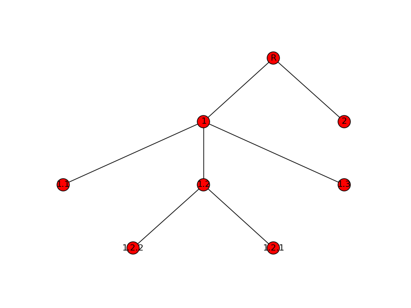

If we wanted to compute the height of the tree, one approach we could take is to
first find all the leaf nodes, compute the distance from each leaf node
to the root, and then take the maximum of those distances.

However, we can solve this in a much more simple and elegant way by exploiting
the recursive nature of the data structure:

#. Base case: A leaf node has a height of zero, because it is its own root,
   and thus there are no edges separating it and any other nodes.
#. Recursive case: If we have a tree with a root node and subtrees, then
   we know that the height must be *at least* one, because there is one
   edge separating the root node and each of its subtrees. We just need
   to find the heights of all the subtrees (by making a recursive call),
   find the maximum of all those heights, and add one to it. 

So, we have the following:

.. python-run::
   :formatting: separate

   def height(t):
       if t.num_children == 0:
           return 0
       else:
           subtree_heights = [height(st) for st in t.children]
           return 1 + max(subtree_heights)

.. python-run::

   height(t)

Stimulus Package data
---------------------

Trees can be very useful when processing data that is structured hierarchically.
For example, in February 2009, Congress passed the American Recovery and Reinvestment
Act (aka "the Stimulus Package"), which provided funds for many different
purposes, including infrastructure projects. The stimulus data can be
viewed as a tree: the root of the tree represents the whole country, the
interior nodes in the tree represent states, cities, and categories of
projects, and the leaves represent specific projects.

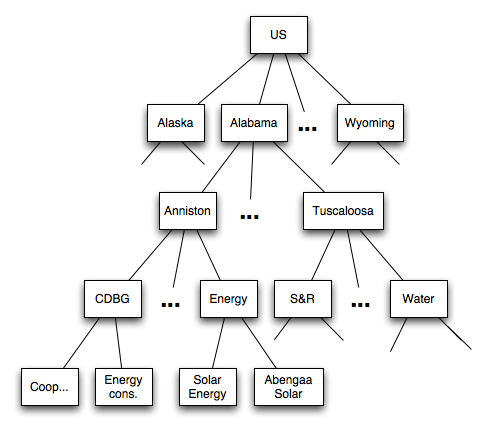

The data about the funds allocated by the stimulus is provided in a CSV 
file with the following fields:

1. City
2. State
3. Project description
4. Jobs created by project
5. Project cost
6. Project program

For example, here are four entries in the file corresponding to Addison,
IL::

   Addison;IL;Resurfacing of approximately 10 miles of various industrial streets within the village. Our industrial streets are typical 2-lanes, 44 back to back of curb and gutter. It will be resurfaced with 1.5 inches  of bituminous asphalt, some storm sewers,;60;12200000;Streets/Roads;[page]
   Addison;IL;Resurfacing of approximately 10 miles of various residential streets within the village. Our residential streets are typical 2-lanes, 34 back to back of curb and gutter. It will be resurfaced with 1.5 inches  of bituminous asphalt, some storm sewers,;60;4400000;Streets/Roads;[page]
   Addison;IL;Resurfacing of Swift Road from US 20 to Collins Avenue, an approximate 4 mile long village minor arterial roadway with a five lane cross section (the fifth lane dedicated as a planted median strip or left turn lane) that carries about 20,000 vehicles;60;9245000;Streets/Roads;[page]
   Addison;IL;Provide water to the 53 Estetes subdivision by the installation of eight inches diameter watermains and stubs, valve vaults, fire hydrants, valve boxes, bituminous patching and restoration of disturbed areas such as parkways, driveways, ditches and draina;50;4400000;Water;[page]

However, instead of processing the data row by row, we can load it into
a tree and process it hierarchically. As shown in the diagram above, the root
of the tree will be the US as a whole, the children of the root will be
the states, the children of the state nodes will be the cities, etc. The
key of each node will be a description, and the associated value for the
node will be a cost.

We provide a ``stimulus`` module that includes several functions to
work with the stimulus data in a tree-like way:

.. python-run::
   :formatting: separate

   import stimulus

You can find this module in our :ref:`example code <example-code>`
under `functions/trees/stimulus.py`.

In particular, the ``read_stimulus_file`` will return a ``Tree`` 
object. We'll start by loading just the Addison, IL data:

.. python-run::

   stimt = stimulus.read_stimulus_file("data/Addison.txt")
   
We can now print the tree using the ``Tree``'s ``print`` method.
We use its ``vformat`` parameter to print the node values,
which represent costs, as dollar amounts:

.. python-run::

   stimt.print(vformat="${:,}")
   
The module also includes a ``print_stimulus_tree`` function
that will print the tree in the manner shown above.
   
Notice how the tree includes the cost values for the individual projects, since
that's the data contained in the file. It would be nice if we could
aggregate these values so, for example, the ``IL`` node contained the
sum of all the project nodes under it:

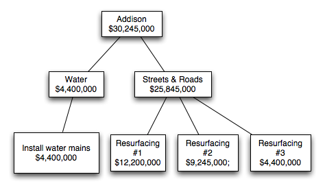

Because trees are a recursive data structure, we can easily
implement this task with a recursive algorithm:

.. python-run::
   :formatting: separate

   def aggregate_stimulus_values(t):
       if t.num_children == 0:
           # We've reached a leaf node. The value of the
           # node will be the cost of a project
           return t.value
       else:
           # We're not at a leaf node yet, which means
           # we need to aggregate the values from all
           # the child trees
           total_cost = 0
           for st in t.children:
               total_cost += aggregate_stimulus_values(st)
   
           # Once we have the total cost, we modify the value of this 
           # tree's root node to reflect that total cost.
           t.value = total_cost
   
           return total_cost

.. python-run::

   aggregate_stimulus_values(stimt)
   stimulus.print_stimulus_tree(stimt)

Now, we can run this on the entire dataset:

.. python-run::

   stimt = stimulus.read_stimulus_file("data/Stimulus.txt")
   stimulus.print_stimulus_tree(stimt, maxdepth=2)
   aggregate_stimulus_values(stimt)
   stimulus.print_stimulus_tree(stimt, maxdepth=2)

Internal representation
-----------------------

So far, we have been working with trees by using a ``Tree``
class with a series of methods and properties that are useful
when writing tree-based algorithms. But how do we represent
trees internally? Earlier, we defined a tree as...

    A node with :math:`0\ldots N` subtrees (or *children*).

We also said that we would consider each node in a tree to
store a key/value pair. So, a ``Tree`` object ``t`` must contain the information about
that tree's root node, and references to the other
``Tree`` objects that are ``t``'s child subtrees. We can do this
with three private attributes:

* ``_k``: The key of the root node
* ``_v``: The value of the root node
* ``_children``: The list of child subtrees.

Whenever we create a ``Tree`` object, we're creating a single node
with no children (so the ``_children`` list will be empty). To build
the rest of the tree, we add other ``Tree`` objects to the ``_children``
list by using the ``add_child`` method, which simply does the following:

.. code:: python

    def add_child(self, other_tree):
        self._children.append(other_tree)

Let's take a look at the tree we created earlier:

.. python-run::

   t.print()

We can see that its ``_children`` attribute is a list with three
``Tree`` objects (corresponding to ``CHILD 1``, ``CHILD 2``,
``CHILD 3``):

.. python-run::

   t._children

If we look at its first child's ``_children`` attribute, we
will see it is a list with two ``Tree`` objects (corresponding 
to ``GRANDCHILD 1.1`` and ``GRANDCHILD 1.2``):

.. python-run::

   t._children[0]._children
   
And if we look at the ``_children`` attribute of either of those
trees, we will see they contain empty lists, because they are 
leaf nodes:

.. python-run::

   t._children[0]._children[0]._children
   t._children[0]._children[1]._children

So, the recursive nature of the tree data structure is embodied
in the ``_children`` attribute, which can contain other ``Tree``
objects which, in turn, can contain other ``Tree``
objects, etc. However, we do not access values in the tree
by writing endless chains of ``._children[]`` expressions. Instead,
we exploit the recursive nature of the data structure to
write recursive algorithms.

While the above representation could be enough in many cases,
it would not be enough to represent represent
:math:`n`-trees: trees where every node has exactly :math:`n`
subtrees. However, this would seem to prevent us from ever
reaching a leaf node (which have *no* subtrees). An 
:math:`n`-tree is actually defined as being:

    1. The null tree, or
    2. A node with :math:`n` subtrees.

In this definition, a "null tree" is similar to having a null set:
it is a tree composed of zero nodes. A leaf node is then defined
as a single node where all :math:`n` subtrees of the leaf node
are null trees. Our implementation of the ``Tree`` class, a null
tree is simply a ``Tree`` object with all its attributes 
(``_k``, ``_v``, and ``_children``) set to ``None``.

Our implementation, however, does not require using :math:`n`-trees.
In fact, notice how none of the examples we have seen so far actually
involved using null trees. However, if we wanted to use our ``Tree``
class to work with an :math:`n`-tree, we would just need to make sure
that every time we create a ``Tree``, we initialize its list of children
with null trees. We will see an example of this in the next section,
where we will discuss a special kind of :math:`n`-tree where :math:`n=2`:
binary search trees.

Binary Search Tree
------------------

A binary search tree, or BST, is a particular type of tree that has a
number of interesting properties. It is a particular case of the general
tree we've seen so far, but where every tree always has two child trees.
We refer to these as the *left child* and the *right child*, and either
or both of these child trees can be null.

Binary search trees also have the following property:

    Given a non-null tree with key :math:`k`, all the nodes in the left
    child must have keys that are strictly less than :math:`k`, and all
    the nodes in the right child must have keys that are strictly
    greater than :math:`k`.

For example, this is a valid BST:

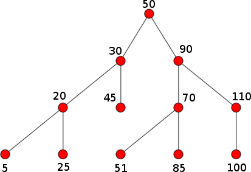

But this is not:

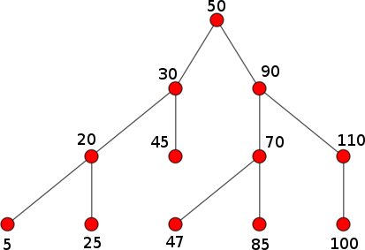

Why? Key ``47`` appears on the right child of ``50``, which violates the
BST property. Notice how, if we looked at the right child in isolation
(i.e., a tree rooted at ``90``), that tree *would* be a valid BST.

The operations on a BST are similar to those on a general tree, except
we have to make sure the BST property is always maintained. So, for
example, we can't create subtrees in arbitrary places like we did with
the ``add_child`` method. Instead, we have a BST-specific ``insert``
method that inserts a key into the tree in such a way that the 
BST property is maintained. In the following examples, we will
be using a ``bst`` module that you can find in our :ref:`example code <example-code>`
under `functions/trees/bst.py`.

.. python-run::
   :formatting: separate

   from bst import BST
   
   bt = BST()

   bt.insert(50, "fifty")
   bt.insert(30, "thirty")
   bt.insert(5, "five")
   bt.insert(20, "twenty")
   bt.insert(90, "ninety")
   bt.insert(70, "seventy")
   bt.insert(110, "one hundred and ten")
    
    
.. python-run::
 
   bt.print()

Notice how all the leaf nodes have two null trees as children.

The BST property means that searching in trees is much more efficient
than searching in lists, because we can progressively divide the search
space in two, just like we did when using binary search. In fact,
the algorithm to search a BST *is* binary search, except instead
of splitting a list in two, we decide to look in either the
left subtree or the right subtree.

The following is the implementation of the ``find`` method. The
``__left`` and ``__right`` properties in this code refer to
the left and right subtree of the current tree.

.. code:: python

   def find(self, k):
       """
       Finds a node with a given key in the tree.
       
       If such a key exists, it returns a tuple with
       True and the value associated with that key.
       
       Otherwise, it returns (False, None)
       """
       if self.is_null():
          return (False, None)
       
       if k < self.key:
          return self.__left.find(k)
       elif k > self.key:
          return self.__right.find(k)
       elif k == self.key:
          return (True, self.value)

.. python-run::

   bt.find(90)
   bt.find(45)
   bt.find(51)

To compare the performance of a list versus a tree, let's
let's create a list with 100,000 random integers, and
then insert those integers into a BST:

.. python-run::
   :formatting: separate

   import random

   MAXSIZE = 100000

   nums = list(range(MAXSIZE))
   random.shuffle(nums)
   
   numst = BST()
   for i in nums:
       numst.insert(i, None)

Now, we can use IPython's ``%timeit`` to compare how
long it takes to find random values inside the list
and inside the BST: 

.. code:: python

   In [1]: %timeit nums.index(random.randint(0,MAXSIZE-1))
   1000 loops, best of 3: 749 µs per loop
   
   In [2]: %timeit numst.find(random.randint(0,MAXSIZE-1))
   100000 loops, best of 3: 11.1 µs per loop

Finding in an unsorted list takes *linear* time: we may have to search all the way
to the end of the list to find the value we're looking for. Finding in a
tree takes *logarithmic* time, since we can use binary search to divide the 
search space in half in each step. 

However, this requires loading all the data into the tree first. Inserting :math:`n`
values into a BST takes :math:`O(n\cdot \log_2 n)` time (each individual insertion
takes  :math:`O(\log_2 n)` time), while inserting :math:`n` values into a list
takes :math:`O(n)` time. Of course, if we're going to perform many search operations,
the increased cost of loading the data into the tree (which is a one-time operation)
may be worthwhile.

There is a caveat, though: finding an element in a tree takes :math:`O(\log_2 n)`
if the tree is *balanced*. A tree is said to be balanced if the difference in the 
height of left and right subtree is not be greater than 1. The insertion
algorithm we've implemented in our BST does not guarantee this property.
In fact, our trees will usually look like this:

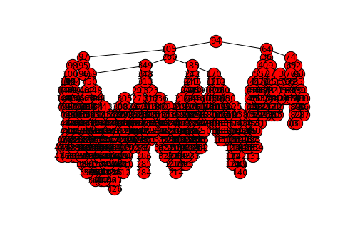

And, in the worse case scenario, if we insert all the values into the tree
in order, we could end up with a tree that looks like this:

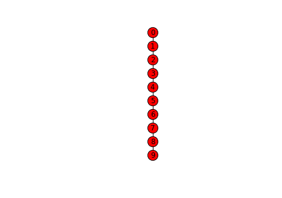

In the above tree, all the left subtrees are null, which means we've 
effectively ended up with a list. While our BST implementation makes 
no attempt to keep the tree balanced, there are other types of BSTs 
(such as AVL trees or Red-Black trees)
that keep the tree balanced, at the expense of more complex insertion
algorithms.
