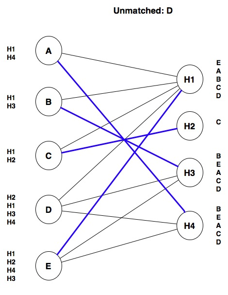

.. _chapter-introduction:

Computational Thinking
======================

When Hurricane Harvey made landfall in the US in August 2017, it caused a 
massive amount of damage and flooding, leaving many people stranded in their 
homes. While considerable resources
were devoted to rescuing people from the floods, one of the biggest
challenges was determining *who* needed to be rescued.
Ordinarily, a call to 911 could alert the authorities about
a rescue situation, but most 911 call centers were backlogged and 
could not process most incoming calls. Instead, many people took to
social media to post about their situation, using the ``#HarveySOS``
hashtag to alert others that they were in need of
help or needed to be rescued.

This ensured that information about who needed to be rescued was
available to anyone who could act on it, including the Coast Guard
and a number of volunteer organizations that sent boats into the flooded
areas on rescue missions. However, sifting through all the uses of ``#HarveySOS``
is not easy: someone on a rescue boat can easily filter Twitter or
Facebook posts by the ``#HarveySOS`` hashtag, but there is no
easy way to find posts made close to the boat's location. On top
of that, some posts may refer to people who have already been rescued,
so a rescue boat could be acting on outdated information.

To facilitate rescue operations, the data needs to be presented to
authorities and volunteers in a way that enables them
to act on it, and there needs to be mechanisms to indicate whether
someone who used the ``#HarveySOS`` hashtag has already been rescued.
While this could be done manually, with volunteers reading each
post and acting as intermediaries between rescuers and rescuees,
this kind of task lends itself nicely to being
automated using computational methods.

In fact, that is what ended up happening in this case: a group of
volunteers around the US and around the world developed tools to
easily extract the ``#HarveySOS`` posts, put them in a database,
display them on an online map that allowed easy access to all the
information that rescue teams needed. Thousands of people were rescued
thanks to this effort.

The Harvey rescue map highlights how computation can be used to solve
problems outside the realm of Computer Science. The people behind the
Harvey rescue map were not developing the next killer app or some
advanced piece of machinery. They had a problem that they cared deeply about,
and they used computers to solve that problem faster and better.

In fact, this book is written for people who don't intend to become
computer scientists or engineers. It is intended for people 
who want to harness the power of computation to solve problems
that matter to them and, more generally, to their chosen field of study.
This may be anything from analyzing some census data and testing a hypothesis
about it to performing a complex simulation of housing segregation models.

.. todo::

   Maybe expand that last sentence into concrete examples by field of study.

Doing so involves a lot more than just learning "how to program."
At the end of the day, learning how to write a computer program is not that hard. 
Take, for example, the following piece of Python code::

   print("Who's a good dog?")
   if number_of_dogs == 1:
       print("You're a good dog!")
   else:
       print("You're all good dogs!") 
       
Without getting into the weeds, you can tell that there appears to be a
mechanism to print messages (``print``) and a mechanism to perform
one action or another based on some condition (``if number_of_dogs == 1`` ... ``else``).
While this piece of code is trivial, you can already tell that
it is not written in some esoteric and cryptic language,
understandable only by seasoned computer scientists. Computer programs
actually tend to be fairly human-readable, and picking up the basics
of a programming language is less intimidating than you may think.

Programming is ultimately a *tool*. The challenge lies in
learning how to *think computationally*: how to translate a problem into terms
that a computer can solve efficiently. This is not unlike what happens
in many other disciplines and crafts: you could learn how to use a 
variety of woodworking tools in a few hours, but it takes a lot more time 
than that to learn how to build a decent cabinet or carve a sculpture
out of wood.

In a sense, the goal of this book is to teach you to think computationally 
rather than to simply teach you to program. Don't get us
wrong: you *will* learn a *lot* of programming in this book, but it
will be in service of computational thinking. Our ultimate goal is
for you to be able to take problems that matter to you and figure out
how to get a computer to solve them.

So, what is computational thinking? Jeannette Wing, in a 
`seminal 2006 article <https://www.cs.cmu.edu/~15110-s13/Wing06-ct.pdf>`_
on the subject, wrote: 

   Computational thinking involves solving problems, designing systems, 
   and understanding human behavior, by drawing on the concepts fundamental 
   to computer science.

While the field of computer science is enormous and Wing's article
discusses many ideas, we will focus on a few concepts and skills that
are integral to computational thinking:

- Decomposition and Abstraction
- Modeling
- Algorithms
- Complexity

In the rest of this chapter we will discuss each of these in more detail and,
throughout the book, we will often highlight the material we
present relates back to these four points.

Decomposition and abstraction
-----------------------------

Computational thinking can help us solve large and complex problems in
a more manageable way. For example, consider the following problem:
how can we find out, after a snow storm in Chicago, whether a given
street in the city has been plowed? 

In 2012, the City of Chicago launched a website called
`Plow Tracker <https://www.cityofchicago.org/city/en/depts/mayor/iframe/plow_tracker.html>`_
that, originally, only allowed users to see the location of the city's snow
plows during a snow storm (at all other times, the Plow Tracker did not display anything).
While that data is useful (in fact, the City of Chicago is a pioneer
in `openly publishing government data <https://data.cityofchicago.org/>`_),
it doesn't solve the problem we posed, unless we watch the plow
tracker intently during a snow storm and wait to see whether a snow plow passes
through a given street.

So, several civic data enthusiasts in Chicago (most of whom, it should
be noted, were not computer scientists) set out to solve this problem
and publish their solution. They built a website, called `ClearStreets
<http://clearstreets.org/>`_, that allows anyone to 
determine whether a snow plow has passed through any address in Chicago 
since the last snow storm.  Building this system required
breaking up this problem into multiple parts, which we will describe
below.

.. info-note::

   The ClearStreets website no longer collects snow plow data, not does
   it allow you to query their database, partially because the City of Chicago's
   own Plow Tracker website now provides the functionality that ClearStreets originally
   set out to provide.

   However, ClearStreets is still a great case study on how ordinary citizens
   with some basic computational skills can build interesting and useful
   systems using openly-available data (which eventually nudged the city
   towards offering that same functionality themselves). The ClearStreet website itself
   still exists, and includes details and documentation on how the
   ClearStreets system was originally built. We encourage you to check it out after
   you've read this chapter!

Obtaining the plow coordinates
~~~~~~~~~~~~~~~~~~~~~~~~~~~~~~

During a snow storm, the city's Plow Tracker produces a sequence of
GPS locations for every active plow. ClearStreets needs a program to
monitor the Plow Tracker during a snow storm and store those GPS
coordinates for use in subsequent queries.  They end up with a 
sequence of latitude and longitude coordinates at specific points in
time, like this::

    ...
    Plow 42 was at 41°47'16.0"N 87°36'03.0"W at 2017-03-14 11:55:19am
    Plow 42 was at 41°47'16.0"N 87°35'53.9"W at 2017-03-14 11:56:20am
    ...

Converting the data into paths
~~~~~~~~~~~~~~~~~~~~~~~~~~~~~~

The data obtained from the Plow Tracker aren't particularly
user-friendly: if someone wanted to find out whether their street had been
plowed, they would need to know the latitude and longitude of their home.
However, even if they converted each latitude/longitude to a street
address, the data would not include all the addresses passed by the
snow plow. For example, the coordinates shown above correspond to the
following two addresses:
     
   * 1010 East 59th Street
   * 1130 East 59th Street
  
What if they live at 1116 East 59th Street? The coordinates of
that address are not in the data we collected, but the snow plow must've
passed through that address (East 59th Street is a one-way street,
and you can't get from 1010 to 1130 without passing 1116).

So, we need to extrapolate the paths of the snow plows from those
sequences of coordinates. As it turns out, this can be a pretty
complex problem. In the above example, we had a one-way
street, but consider a plow that reports the following two
locations:

.. image:: images/streets1.png

We might assume the plow took the shortest path from A to B:

But that doesn't take into account Chicago's many one-way streets:

Taking the shortest path would actually involve going the wrong way
down a one-way street! It's more likely that the plow followed
this path:

Fortunately, converting GPS coordinates to paths is a well-studied
problem, and there are many existing software solutions
available. ClearStreets actually uses a system called `OSRM
<http://project-osrm.org/>`_ (Open Source Routing Machine) to convert
the GPS coordinates from the Plow Tracker into plausible paths on a
street map.

Visualizing and querying the data
~~~~~~~~~~~~~~~~~~~~~~~~~~~~~~~~~

Finally, ClearStreets had to provide an interface for users to query
the data and easily visualize it.  These tasks are themselves quite
complex and are handled using a combination of tools including CSS,
HTML, JavaScript and CartoDB.  The end result looked like this:

Through the `ClearStreets website <http://clearstreets.org/>`_, users
were able to type in an address, and then see on the map whether or not a plow
passed through an area.

-------------------

The ClearStreets example shows how computational thinking involves
*decomposing* complex problems into smaller, more manageable pieces
that provide a layer of *abstraction* over all the details of the
problem. This means that, instead of trying to solve one large problem, 
we can solve several smaller problems in a way that makes
it easier to divide up the work among a team, as well as making each
individual piece easier to test and maintain in the long run.

This problem-solving approach has several benefits.
First, it separates different
parts of the program. The part of the program that converts
coordinates to paths on a map only has to focus on solving that
particular sub-problem, without being concerned with how the other
parts of the program work. In fact, in a well-designed program, we
should be able to replace the mechanism that converts points to paths
(e.g., because we developed a better algorithm for this task) without
the other parts of the program needing to know about this change.
Similarly, if a given piece of code focuses on one specific task, it
will be easier to test whether that code is implemented correctly.

It also allows us to reuse code across projects. ClearStreets used 
an existing piece of software, OSRM, so that it would not have to solve
the coordinates-to-paths problem from scratch. In fact, in most
situations, it is considered better to solve a problem by using
existing code (either written by yourself or your team, or provided by
some other project, like OSRM) instead writing the entire solution
from scratch.

Of course, when we decompose a single problem into multiple parts, we must ensure
that all of the pieces can work together.  This task is especially
challenging when different people write each piece,
which is very common in many software projects. To address this
challenge, each piece must clearly define some sort of *interface*
that specifies what kind of data it expects and what kind of data it
produces.

For example, it would be very easy to get a mismatch between the code
that collects the plow coordinates and the code library used to
convert coordinates to paths.  The person who was in charge of writing
the code to collect plow coordinates might decide to write code that
produces a sequence of addresses as output, because that format seems
intuitively useful for the overall task of answering questions about
whether a specific street has been plowed.  While this choice has some
merit, it does not work well with the library that converts
coordinates to paths, which expects a sequence of GPS coordinates
(latitude/longitude) as input.

Throughout the book, we will see that there are various ways
to decompose a problem into smaller pieces, but that it
will be important to define good interfaces when we do so.
We will also be emphasizing that these smaller pieces
need to be testable, and we'll see that there are tools
that allow us to automatically run tests on specific
parts of our code.

Modeling
--------

Another aspect of making complex problems more manageable is to
distill the problem into its essential components, so that we don't
waste time and effort on aspects of the problem that are irrelevant to solving 
it. This is different from decomposition and
abstraction, in which we try to break down a complex problem into more
manageable sub-problems. Now, we will focus coming up with a *model* that 
captures the essence of a given problem while allowing a computer program to
solve it.

Modeling is not unique to computational thinking. For example, you may be familiar
with economic models, statistical models, or mathematical models. In
general, models formalize an aspect of the real world in a way 
that allows us to reason about it.

.. todo::

   Find simple example of economic model where we can say something
   of the form "For example, an economist could use model FOO to
   predict BAR given existing conditions BAZ"
   (@AMR: maybe grit and college perseverance? earning and education? 
   or, even simple supply and demand?)

While modeling is not unique to computational thinking, it is a
central aspect of it. As we will see throughout the book, a programmer
has a number of *data structures* at their disposal when writing
a program. Solving a problem computationally requires a programmer to figure out 
how to use data structures to represent aspects of the problem.
Or, to put it another way, the programmer must figure out 
how to *model* the problem using those
data structures before performing any computations. 

For example, let's take a look at the problem of matching
medical students to residency training programs. 
When someone graduates from
medical school, they next complete a *residency* at a hospital 
under the supervision of an attending
physician (a more senior physician that has already completed a residency).
The `National Resident Matching Program <https://en.wikipedia.org/wiki/National_Resident_Matching_Program>`_,
also known, somewhat ominously, as "The Match", matches medical students 
to resident positions in hospitals. 

This problem lends itself nicely to a computational solution but,
before we can think about specific procedures to match students to
hospitals (which we'll discuss in the next section), we first need to
decide on a model for this problem. In particular, consider that a
student could say something like, "I prefer a hospital in the West
Coast, but I'm open to hospitals in the Midwest as long as they're
highly-ranked", and a hospital could say, "We prefer students
from top schools, but will take truly exceptional
students from lower-ranked schools".  We need to represent these preferences in a
way that a computer program will be able to process.

One approach is to model every possible preference.
For students, we would include location, quality of program, specialty, and so on, and
for hospitals, we would include ranking of the student's medical school, the student's
specialty, and so on. We would attach a numeric score to each, where 0 is 
"not important at all" and 10is "very important". 
So, if a student scored "West Coast location" with a 10
and "Midwest location" with a 5, the program would try to match
that student with a West Coast hospital (or, possibly, a Midwest hospital
if that hospital has other characteristics that score highly for that student).
Notice that we would also have to model certain attributes of the students
and the hospitals, like where the hospital is located and what specialty the student
wants.

Coming up with a model that captures every possible preference can
quickly become intractable. While there are some problems where
such an approach may be appropriate, this model 
should boil down the problem to its very essence. If we think
about it, students are ultimately providing a series of
rules to determine whether one hospital is better than another. So, a
much simpler model would be to ask each student to rank the hospitals
they are interested in. Similarly, hospitals would be asked to rank
the students they are willing to hire as residents. This is, in fact,
what The Match asks them to do.

So, if we have five students (A, B, C, D, E) and four hospitals (H1, H2, H3, H4),
we could model each student's preferences as a ranked list of hospitals:

* Student A: H1, H4
* Student B: H1, H3
* Student C: H1, H2
* Student D: H2, H1, H3, H4
* Student E: H1, H2, H4, H3

And each hospital's preferences as a ranked list of students:

* Hospital H1: E, A, B, C, D
* Hospital H2: C 
* Hospital H3: B, E, A, C, D
* Hospital H4: B, E, A, C, D

We can further simplify our model. It doesn't make sense to keep
track of unrequited preferences. For example, Hospital H3 is willing to hire any of
the five students, but only students B, D, and E listed H3 as a choice. We could
represent these preferences graphically by connecting a student and a hospital with
a line if and only if the student and the hospital both listed each other in their
list of preferences. So, we would have something like this:

.. image:: images/res0.jpg
   :width: 60%

As it turns out, this is a data structure called a *graph*, where we
model certain things as nodes (in this case, the students and
hospitals) and we model a relationship between the nodes using
lines or *edges* (in this case, whether a student and a hospital
mutually prefer each other). Notice that there are no edges that connect
students to other students or hospitals to other hospitals; this is a
type of graph called a *bipartite graph* because the nodes are
divided into two categories (students and hospitals) and each edge
connects a node from one category with a node from the other. 

In this graph, an edge indicates a *potential match*. Notice that each
student also has a ranked list of hospitals so, given two potential
matches, we can tell which one is more desirable to the student. Likewise,
the hospitals have ranked lists of students. 

Ultimately we have to produce the actual matches between students and hospitals, so our 
model needs to distinguish
between edges that represent potential matches, and edges that represent actual matches.
We can do so by having two types of edges: one for potential matches and one for
actual matches. Graphically, we can represent actual matches with a thicker blue line:

.. image:: images/res7a.jpg
   :width: 60%

Keep in mind that any student will be matched with at most one
hospital.  Notice that our model allows some
students to be unmatched (in this case, Student D is not matched with
any hospital).

Hospitals usually have multiple residency programs, each with multiple
slots, but we're going to assume that
each hospital hires at most one resident for simplicity.

For this particular problem, this graph is our model. Anything that can't be represented
in this graph, and thus in our model, is outside of the scope of our computational
solution.  In an actual computer program, we would probably use an existing
software library that allows us to manipulate and query graphs, allowing us to implement
the model we just designed. This is an example of abstraction: we don't have to
worry about the internal details of how a graph data structure is implemented, because
we can probably find a software library that provides operations like "Add node called X
to graph" , "Check whether node X and Y are connected", "Change edge between Y and Z from
potential match to actual match", etc., in the same way that the
developers of ClearStreets abstracted away the details of converting GPS coordinates
to paths by using the OSRM library.

Now that we have defined our model, we should also define what it means to have a "good match"
in the context of our model. As it turns out, computer scientists have thoroughly studied
matching problems like this one, and there is something called a "stable match" 
that suits our needs. A stable match is one where, for every possible pairing of a student S with a hospital H, the following
two conditions are not both true:

  #. S is unmatched, or would prefer to go to H over the hospital that S is currently matched with.
  #. H is unmatched, or would prefer S over the student it is currently matched with.

A more intuitive way to think about this is that a solution is stable if there is no 
(student, hospital) pair such that they both prefer each other over their current match 
(or lack of match). 

Our earlier matches are stable, even in the case
of student D. For all the possible pairings of D with a hospital (D with H1, D with H2, D with H3, and D with H4), the first condition is true, because D is unmatched, but the second condition is never true: all the hospitals either did not want D, or they're matched with a student that they ranked higher than D. 

As a counter example, here is a simple unstable match:

Both matches break the conditions for stability: A would prefer to go to H0, *and* H1 would prefer 
B over A. Similarly, B would prefer to go to H1, *and* H0 would prefer A over B.

-------------------

This example highlights how we need to
*model* a problem in a way that allows us to operate on it
computationally before we can solve it. Since we haven't started writing code yet, the
graph model we present may still seem abstract.  Graphs, however, are
a very common data structure. If we can model a
problem as a graph, there is a good chance that we will be able solve
it computationally.

Of course, graphs are not the only way to model a problem. As we'll
see throughout the book, we have many data structures
at our disposal and picking the right data structure is crucial to 
modeling a problem. Not just that,
we can also build new data structures using
a paradigm called object-oriented programming that will
give us considerable flexibility to model the information we need
to solve a problem computationally.

Algorithms
----------

When explaining the National Resident Matching Program we provided a simple
example where some students and hospitals ranked each other. This information,
which we model as a graph, is the *input* of our problem, while the *output*
of our problem is a stable match for the given input. In fact, at its most basic
level, this is what a program does: it takes some input and, based on that input,
performs a series of computations that produce some output: 

.. image:: images/producing_result.png

However, while we defined what constitutes a stable match, we did not explain *how* we arrived
at the stable match we presented. We actually did so by going through each student, and trying
to make the best possible match for that student, possibly unmatching another student
if doing so results in a better match. Let's work through this one step at a time. Our
input looks like this:

   
Notice that, at this point, all students are unmatched. We will start with student A.
Since A's top choice is H1, we will make that match:

At this point, this is a *tentative* match because there could find a better
match as we look at the rest of the students. 

We next look at B: that student also
wants hospital H1. Because H1 prefers A over B, we don't match B with H1. Instead,
we tentatively match B with its next choice, H3:

.. image:: images/res3.jpg
   :width: 60%
  
Similarly, C won't get matched with H1 because that hospital ranks A (its current tentative
match) higher than C. Instead, we tentatively match C with H2:

.. image:: images/res4.jpg
   :width: 60%

Next, D cannot be matched with H1 (it prefers A), or with H3 (it prefers B), but we can
tentatively match D with H4:

Things get interesting when we look at E. E's top choice is H1, and H1 is tentatively
matched with A. However, H1 prefers E over A, so we *unmatch* A and tentatively match
E with H1:

At this point, we have made one pass through all of the students, but we do 
not yet have a stable match: A is unmatched, and
one of the hospitals A wants, H4, is matched with a student, D, that is ranked lower
than A. So we repeat the process for A: we can't match A with H1, because H1 prefers
E, but we can match A with H4, unmatching D in the process:

Finally, we make one last (unsuccessful) attempt to match D.

At this point, we have arrived at a stable match and stop. We could define 
our steps a bit more formally like this:

1. Look at the first student. We will refer to that student as *S*.
2. Look at the first hospital ranked by student *S*. We will refer to
   this hospital as *H*. Do the following:

   a. If *H* is not matched to any student, tentatively match *H* with *S*,
      and go to step 3 (no need to look at other hospitals).
   b. If *H* is matched with another student *S'* and *H* prefers *S*
      to *S'*, then unmatch *S'*, tentatively match *H* with *S*, and go to
      step 3.
   c. If *H* is matched with another student *S'* and *H* does not prefer *S*
      to *S'*, then repeat steps 2(a)-2(c) with the next-ranked hospital as 
      *H* (i.e., look at the next hospital for student *S*).

3. If we have made a pass through all the students without changing any matches,
   we have arrived at a stable match. Stop the program.

4. Otherwise, we repeat steps 2-3 with the next unmatched student as *S*
   (if we're looking at the last unmatched student, we return to
   the first one).

Note that we don't actually have to check whether a match is stable or not. Instead,
we repeat a series of steps until we have made a pass through all the students
without changing any matches.

We call a concrete set of steps like this an *algorithm*. While we have described it here
in English, it could instead be written in a programming language like Python, Java, or
C++. As we'll see in the next chapter, programming languages provide 
syntax to specify such steps, and can indicate whether to repeat
some steps or to take some action based on the outcome of some test. 

Once we have written these
steps in a programming language, a computer will be able to run through those steps
automatically; we won't need to manually go step-by-step like we did above. However, as
we'll soon see, programming languages are much less expressive than human languages
like English. This means we can't describe the steps in a hand-wavy fashion and
trust that the computer can figure out the gaps. Instead, we must specify 
the steps to take precisely and without ambiguity.

-------------------

This algorithmic approach to solving problems, where we must specify the concrete
steps we want to take, is a key aspect of computational thinking. It makes us better
problem solvers because it requires us to think hard about the exact steps that
will take us from a given input to some desired output.

While we will have to figure out many algorithms on our own, there are
also many existing algorithms that we can use and, more generally,
various algorithmic approaches that we can try when we tackle a given
problem. The algorithm shown above is an example of a
*greedy* algorithm, where the general approach is to choose the best
tentative match possible for each student. We happen to know this
algorithm reaches a stable match because other computer scientists
have formally proven that property for this particular algorithm.

In fact, the algorithm we just described is essentially the same
algorithm used in the National Resident Matching Program, and it
produces very good results: in 2016, fourth year
medical students in the US (of which there were more than 18,000) 
had a match rate of 93.8% and 96.2% of the
positions were filled. The NRMP website used to include
`a fairly detailed description of the algorithm <http://web.archive.org/web/20130121082051/http://www.nrmp.org/res_match/about_res/algorithms.html>`__,
which has since been replaced with `this video <https://www.youtube.com/watch?v=kvgfgGmemdA>`__.
  

Complexity
----------

.. todo::

   Not sure if the number of matches shown below is correct.

The greedy algorithm is not the only algorithm for finding a stable
match. For example, we could've taken a different approach. For example, 
we could have considered every
possible match between students and hospitals and, for each, checked
the match's stability. This seems simpler 
than the greedy algorithm, but it is also a pretty terrible one: 
for :math:`N` students and :math:`M` hospitals, we would need to look at up to 
:math:`\frac{N!}{(N-M)!}` possible matches and, for each of them, we would need
to inspect every possible pair of students and hospitals (a total of :math:`N\cdot M` pairs)
to check the stability conditions. This is known as a *brute-force*
algorithm, because we take the approach of producing every possible
solution and checking whether it meets some conditions (in this case,
whether the match is stable). 

Programs that implement brute-force
algorithms typically take a very long time to run and, in most cases,
inefficiently solve a given problem. The greedy algorithm, on the other hand, requires at
most :math:`N\cdot M` operations
on the graph (this is much much much less than the :math:`\frac{N!\cdot N \cdot M}{(N-M)!}` operations
required by the brute-force algorithm). 

It's not enough to select *an* algorithm, we must know how to compare algorithms
and determine whether one is more efficient than another. Later in the book, we will present
a more concrete way of thinking about this but, in a nutshell, we will want to be mindful
of how the number of operations an algorithm performs grows relative to the size of
the input. For example, the brute-force algorithm might actually be fine for small values
of :math:`N` and :math:`M`, but its running time will grow exponentially with 
:math:`N` and :math:`M` (while the running time of the greedy algorithm won't).

Similarly, we must also know how to recognize when we are confronted by a
hard problem:

.. figure:: images/xkcd.png

   Source: https://xkcd.com/1425/ (Randall Munroe, 2014, `CC BY-NC 2.5 <https://creativecommons.org/licenses/by-nc/2.5/>`__)

In fact, there are entire categories of problems that cannot be solved efficiently
by a computer. For example, we could tweak our model to allow students to specify
partner constraints: some students may be in a relationship so they want to be
matched with the same hospital, or with hospitals that are reasonably close to each other.
In the following graph, the dotted lines represent relationships between students
and hospitals that are close to each other:

.. image:: images/couple1.jpg

This seemingly simple tweak to our model actually makes the problem much harder to
solve. In fact, not only is the greedy algorithm no longer valid, it turns out
that the only guaranteed way to arrive at a stable match is by using the brute-force
algorithm *and* there is no guarantee that such a stable match will exist. In a case
like this, we would have to rely on other types of algorithms, such as probabilistic
algorithms, that are not guaranteed to find the best possible match, but can usually
find a near-optimal match in much less time than the brute force algorithm.

The "difficulty" of a problem or of a given algorithm is referred to as its
*complexity*. Throughout the book, we will highlight how we must be aware of
the complexity of the algorithms we write, as well as of what data structures
we choose for a given problem.

   
.. todo::

   Roadmap for the book. We should probably wait until we've wrapped
   up any remaining chapters. 
   
   Things to mention:
   
   - We will be using Python. Explain why.
   - Outline of chapters
   - Emphasize the "with applications" part, and how much of the rest
     of the content of the book is very applications-oriented.

